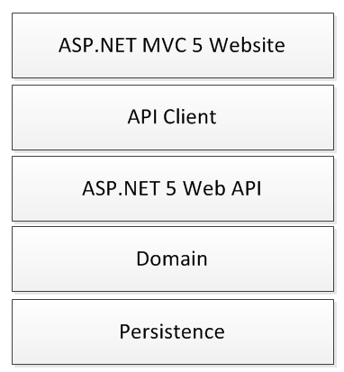

At work we have started moving towards a standard .NET application architecture for most of our apps. This uses MVC 5 website with a REST client talking to a Web API 5. When you open a visual studio solution, as a minimum you see the following projects...  
  
  
Initially we started to use Web APIs because of the nature of our customer requirements as well as the constraints of the infrastructure we are deploying to. However, as we started to focus all our business logic in this layer it offered a lot of flexibility as applications grow in size and complexity, hence why it has become part of our standard approach. The API makes use of OData and any grid views on the website use ajax to call out to the API for filtering and sorting which works very nicely. We use the Entity Framework (currently Version 6.) with code first migrations for our persistence layer, and the context, configuration and migrations all sit in the Persistence project. The entities are moved off into a Domain project - this is probably misnamed, there is no real domain logic in the domain project, they are predominately database objects not business objects. So our standard stack actually covers a lot of different technologies and that's without even thinking about TeamCity, Octopus, Powershell or deployments. This is the reason I started this blog, to start thinking in more detail about the different aspects of this stack, to start practicing using these technologies and learning to use them efficiently and effectively!
