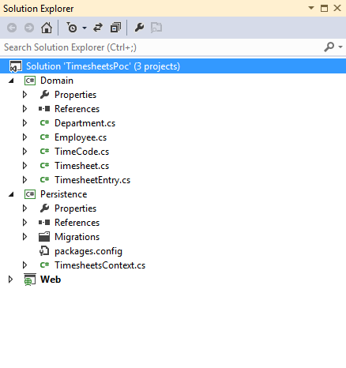

The [documentation](https://msdn.microsoft.com/en-gb/data/ee712907)  for the Entity Framework provides thorough introduction, in this post I start with the [basic tutorial for code first](https://msdn.microsoft.com/en-gb/data/jj193542) with a view to setting up an application I can use to practice some technologies and techniques on in the future.  
Normally I would split the applications domain classes from the context and migrations code giving rise to a Domain project and a Persistence project: 

### Creating a Domain Project

The domain project should have just the plain poco classes which represent the entities to be persisted to the database. This project HAS NO reference to entity framework, so when deploying across multiple tiers there is no requirement to deploy the Entity Framework libraries or the context class and the migrations code with the pocos. An example domain is shown below:
```csharp
public class Department
{
	public int Id { get; set; }
	public string Code { get; set; }
	public string Name { get; set; }
	ICollection<Employee> Employees { get; set; }
	ICollection<TimeCode> TimeCodes { get; set; } 
}

public class Employee
{
	public int Id { get; set; }
	public string Forename { get; set; }
	public string Surname { get; set; }
	public string Email { get; set; }
	public bool IsAdmin { get; set; }
	public ICollection<Timesheet> Timesheets { get; set; }
}

public class TimeCode 
{
	public int Id { get; set; }
	public string Name { get; set; }
	public string Description { get; set; }
}

public class Timesheet
{
	public int Id { get; set; }
	public ICollection<TimesheetEntry> Entries { get; set; }
	public bool IsAuthorised { get; set; }
}

public class TimesheetEntry
{
	public int Id { get; set; }
	public DateTime Date { get; set; }
	public TimeCode TimeCode { get; set; }
	public int TimeSpent { get; set; }
}
```
  

### Creating a Persistence Project

Next, create a Persistence project and install the entity framework using the package manager console. This is the project that will actually does the saving and retrieving of data. install-package EntityFramework Add a class to the Persistence project called TimesheetsContext and extend the Entity Framework DbContext class. This base class provides the functionality to save to the database. Now add a series of properties to the context class of type DbSet which are all of the classes from Domain as required. Note that if a class in Domain is not referenced either directly in the context class, or indirectly in one of the context child classes then it wont get persisted and the database wont know about it.

  
```csharp
public class TimesheetsContext : DbContext
{
    public DbSet<Employee> Employees { get; set; }
    public DbSet<Department> Departments { get; set; }
    public DbSet<TimeCode> TimeCodes { get; set; }
    public DbSet<Timesheet> Timesheets { get; set; }
}
```
  

That's all you really need to be able to save and load objects from the database. The Entity Framework is installed and setup via the context class so if you add any objects to the appropriate DbSet and then call save changes on the context, then it will be persisted. The database will get created the first time the context is called.

### Setting up Migrations

Code migrations are used if you need to change the database somehow, by adding columns, data annotations, constraints or new entities. To enable migrations you simply call the appropriate command in package manager console (make sure your default project is set to Persistence): Enable-Migrations This will create a Configuration class inside a Migrations folder. To create a migration for your current domain model, call the add migration command from the package manager console. When running the Add-Migration script, the command needs to know the name the generated migration is to use, the startup project to get the connection string from and the project name where the context is: Add-Migration -Name InitCreate -ProjectName Persistence -StartUpProjectName Web When using the package manager console, the start up project selected in visual studio is used by default for StartUpProjectName and the Default project selected in the package manager console drop down is used for the Project Name. If these values are set correctly, you only need to use: Add-Migration InitCreate As this is powershell, you can find out more information about the commands using get-help: Get-Help Add-Migration -full

### Rolling back Migrations

Migrations are designed to be rolled back and rolled forward. If you want to roll back to a particular version, you use the TargetMigration switch and specifiy the migration. update-database -TargetMigration 201404141340461\_AddDepartmentEntity  
  
This is a roll back if your database is currently on a later version. If your database is actually on an earlier version then in affect your rolling forward. The \_MigrationHistory table in the database is used by EntityFramework to determine the current state of the database.

### Explicitly update Migrations

Usually I use the IDE to update the database with new migrations. The update-database command reads the default project as the migrations project, and the startup project as the, well start up project. You can do this from the command line using the following command:  
  
update-database -ProjectName Persistence -StartUpProjectName API
