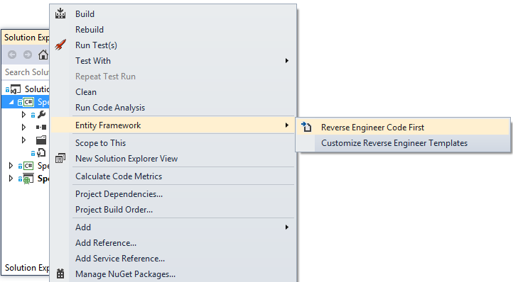
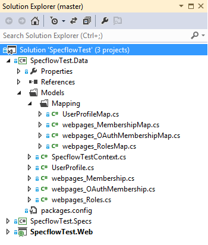

Recently I had a need to create an entity model from an existing database so started adding an edmx as I had done so many times before in this scenario. Then I remembered reading on the [Entity Framework documentation](https://msdn.microsoft.com/en-gb/data/ee712907) website that its actually possible to [reverse engineer a code first model](https://msdn.microsoft.com/en-us/data/jj200620). I went through the tutorial and it was all pretty straight forward. It's actually a feature of Entity Framework power tools (VS2012 Update 4) which provides a reverse engineer model from database option in the context menu:  After running through the wizard, a set of pocos are created with corresponding configuraion files where applicable. [Here is the output](https://github.com/johnmmoss/SpecflowTest/tree/master/SpecflowTest.Data/Models) when run against the standard ASP.NET MVC 4 Internet template database:   
Although it (appears to be) a feature of the tooling rather than any framework cleverness, this feature does require Entity Framework 6.1 to work though.
