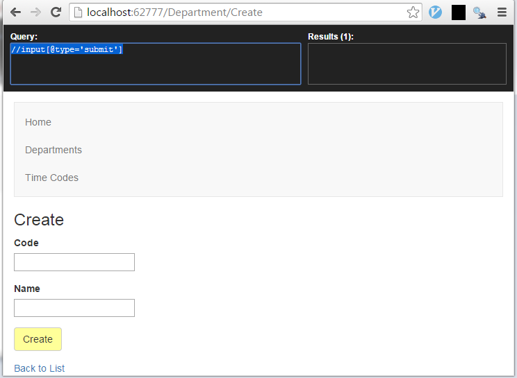

Once you have setup your acceptance tests using the page object pattern as described in an [earlier post](http://mossup.blogspot.co.uk/2015/02/writting-acceptance-tests-using.html), and you continue to write scenarios you will end up needing to use the Selenium API to find HTML components as part of the acceptance test scenarios. The Selenium By class provides several useful hooks to finding HTML components on the page, using Id, ClassName or XPath. Once a component is found, it is possible to click it, send text to it (SendKeys), clear it and submit the form it is in.

### Some simple examples

For the most part finding components on the page is pretty straight forward:
```csharp
// Find the submit button using an xpath
webDriver.FindElement(By.XPath("//input[@type='submit']")).Click();

// Find a field by its id and update it
var descriptionElement = webDriver.FindElement(By.Id("Name"));
descriptionElement.Clear();
descriptionElement.SendKeys("UPDATED");

// Get the text for all items with a class name of li-content
var liElements = webDriver.FindElements(By.ClassName("li-content"));
var result = new List<string>();
foreach (var liElement in liElements)
{    
	result.Add(liElement.Text);       
}
return result;
```
  

### Selecting the Rows of a Html table

This ended up being more complicated than I realised, because there is a header row in my tables and also an actions row with links. In the end I decided just to label the rows and cells that I wanted using CSS and I could then load out the required values:
```csharp
var trElements = webDriver.FindElements(By.ClassName("tr-content"));
var result = new List<List<string>>();
foreach (var trElement in trElements)
{
    var row = new List<string>();
    foreach (var tdElement in trElement.FindElements(By.ClassName("td-content"))) 
    {
        row.Add(tdElement.Text);
    }
    result.Add(row);
}
return result;
```
  

### Submitting a Form

There are several ways to submit a form, but note that there is a shortcut - you can call submit on any element in the form and it will automatically submit the parent form of the element:
```csharp
// Find the submit button and click it
webDriver.FindElement(By.Id("CreateButton")).Click();

// Find the form by its tag and submit it
webDriver.FindElement(By.TagName("form")).Submit();

// Call submit on the element, it automatically submits the form
var descriptionElement = webDriver.FindElement(By.Id("Name"));
descriptionElement.Clear();
descriptionElement.SendKeys(description);
descriptionElement.Submit();
```
  

### Clicking a button in Html table

In the situation where we have column of actions and one of those is an Edit link, then we can use an XPath to select the button in question:
```csharp
// Click the a link of the tr where a td has a value of "Leeds", and the a link has the text "Edit"
var name = "Leeds";
var xpath = string.Format("//tr[td[normalize-space(text())='{0}']]/td/a[normalize-space(text()) = \"Edit\"]", name);
var editLink = webDriver.FindElement(By.XPath(xpath));
editLink.Click();
```
  

### Discovering if A Component is Visible

If a component is not found on a page, then a NoSuchElementException is thrown. So if we are trying to discover if an item has just been deleted and is no longer in the relevant view, we can use this behaviour:
```csharp
// Check if the provided value exists in an html table cell
public bool RowExists(string value)
{
  try
  {
      var rowXPath = string.Format("//tr[td[normalize-space(text())='{0}']]", value);
      webDriver.FindElement(By.XPath(rowXPath));

      return true;
  }
  catch (NoSuchElementException)
  {
      return false;
  }
}
```
  

### Some XPath Help

The more you start doing with Selenium API, you inevitably start using XPath more which is a bit of a pain. Its worth getting a browser plugin to help you write the XPath syntax. Below is a view of Chrome with XPath Helper plugin. (Press _Ctl + SHIFT + x_ once installed.)   
Here are some useful links to help get you up to speed on XPath:

-   [XPath in Five Paragraphs](http://www.rpbourret.com/xml/XPathIn5.htm)
-   [XPath Examples](https://msdn.microsoft.com/en-us/library/ms256086\(v=vs.110\).aspx) (MSDN)
-   [Location Path Examples](https://msdn.microsoft.com/en-us/library/ms256236\(v=vs.110\).aspx) (MSDN)
