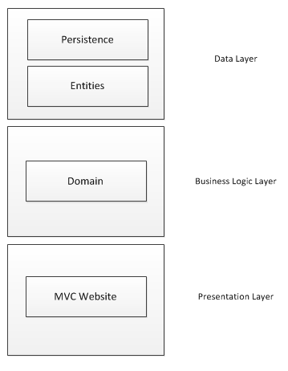

A while ago I talked about the [standard architectural approach at work](http://mossup.blogspot.co.uk/2015/02/aspnet-mvc-standard-application.html). The truth is I'm not completely taken with putting an API in, particularly when its a small application. So how would an application look without the API? Well, I know all of the patterns, but I haven't actually put them together and had a poke around and understood the whys and wherefores of each design decision, so I thought I would give it a try... I read through the following resource online, and also referred back to [Patterns of Enterprise Application Architecture](http://www.amazon.co.uk/Enterprise-Application-Architecture-Addison-Wesley-Signature/dp/0321127420/ref=sr_1_1?s=books&ie=UTF8&qid=1427801198&sr=1-1&keywords=patterns+of+enterprise) and [Architecting Applications for the Enterprise](http://www.amazon.co.uk/Microsoft%C2%AE-NET-Architecting-Applications-PRO-Developer/dp/073562609X) as well as chatting with some of my colleagues at work to further my understanding.  

-   [Testability and Entity Framework 4.0](https://msdn.microsoft.com/en-us/library/ff714955.aspx)
-   [Implementing the Repository and Unit of Work Patterns in an ASP.NET MVC Application](http://www.asp.net/mvc/overview/older-versions/getting-started-with-ef-5-using-mvc-4/implementing-the-repository-and-unit-of-work-patterns-in-an-asp-net-mvc-application)
-   [Repositories On Top UnitOfWork Are Not a Good Idea](http://rob.conery.io/2014/03/04/repositories-and-unitofwork-are-not-a-good-idea/)
-   [Favor query objects over repositories](http://lostechies.com/jimmybogard/2012/10/08/favor-query-objects-over-repositories/)
-   [Advantage of creating a generic repository vs. specific repository for each object?](http://stackoverflow.com/questions/1230571/advantage-of-creating-a-generic-repository-vs-specific-repository-for-each-obje)

I started writing a simple toy CRUD application which is [checked in to GitHub](https://github.com/johnmmoss/TimesheetsPoc). Its a work in progress, and there is a lot of work to progress, but it demonstrates a solution to the three layers using a C# .Net web application. The basic layout of my 3 layer architecture can be seen below: 

### Business Logic Layer

My domain project fulfills the role of the business logic layer. The main change I have made from the standard architecture is to swap out the Web API project for a set of service classes. For now the domain will be implemented in a procedural fashion in these classes, but as the complexity of the application grows I will review this decision.  

### Domain Objects

I decided to use my persistence objects or entities as my domain objects as a bit of a short cut. In theory the three layers would be completely isolated, and as such would have objects that they operate on to perform their various functions - Entities/DTOs/Models. I will be using model objects in the website, but the entities which are persisted to the database are the same objects that the BLL will use to perform business functions.  

### Persistence

The persistence layer makes use of some well known patterns. I saw some interesting debates around whats considered good and/or bad with layers and patterns. I decided to use the following patterns, in the following ways, for the started reasons.  

#### Repository Pattern

The oft quoted definition is "mediates between the domain and data mapping layers using a collection-like interface for accessing domain objects." So in short, we are looking for abstraction or isolation away from the ORM technology we are using. I favored a generic repository in my initial incarnation of this project because this provides abstraction away from the ORM but without the need to write lots of boiler plate code.

#### Unit Of Work

The role of the Unit Of Work pattern is to "maintain a list of objects affected by a business transaction and coordinates the writing out of changes and the resolution of concurrency problems." The key focus here is how do we manage transactions.

### Summary

This is a first take on how I think a simple layered architecture (without API) would look. I intend to review, and revisit as the application grows and gets more complex. There's ALOT of work to do before this application will get complicated though, so better get a shifty on.
