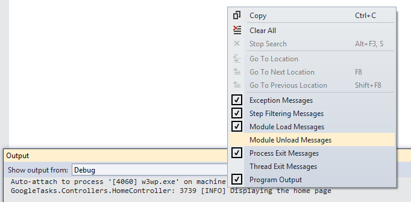

I seem to burn far to many hours trying to do the relatively simple task of setting up log4net on a project. Well step one is easy enough, [install through nuget](https://www.nuget.org/packages/log4net/). Next...

### Add web.config settings

I like to create a separate config file for log4net because it keeps things simpler. So add the following config:
```xml
<configSections>
  <section name="log4net" type="log4net.Config.Log4NetConfigurationSectionHandler, log4net" />
</configSections>

<!-- more config -->

<log4net configSource="log4net.config" />
```
  

### Add the log4net config file

Next add a file called log4net to your solution and add the following config. This is a good starting point, logging to a file and also to the console. There is ALOT of [config options for log4net](https://logging.apache.org/log4net/release/manual/configuration.html), but this is a good starting point:
```xml
<?xml version="1.0" encoding="utf-8"?>
<log4net>

  <!-- Log to vs output window -->
  <appender name="TraceAppender" type="log4net.Appender.TraceAppender" >
    <layout type="log4net.Layout.PatternLayout">
      <conversionPattern value="%timestamp [%level] %-60message  %newline" />
    </layout>
  </appender>

  <!-- Log to console app window -->
  <appender name="Console" type="log4net.Appender.ConsoleAppender">
    <layout type="log4net.Layout.PatternLayout">
      <conversionPattern value="%message%newline" />
    </layout>
  </appender>

  <!-- Log to a file -->
  <appender name="RollingFileAppender" type="log4net.Appender.RollingFileAppender">
    <file value="Logs\log.log" />
    <appendToFile value="true" />
    <rollingStyle value="Size" />
    <maxSizeRollBackups value="10" />
    <maximumFileSize value="1MB" />
    <staticLogFileName value="true" />
    <layout type="log4net.Layout.PatternLayout">
      <conversionPattern value="%date [%thread] %level %logger - %message%newline" />
    </layout>
  </appender>
  
  <root>
    <level value="ALL" />
    <appender-ref ref="TraceAppender" />
    <appender-ref ref="Console" />
    <appender-ref ref="RollingFileAppender"/>
  </root>
</log4net>
```
  
Don't forget to set the **log4net.config** file to **Copy Local** in visual studio properties window.

### Initalise the xml config

This is the bit I always forget. One line of code you stick somewhere in your app startup to get log4net to initialise using the xml configuration we just added;
```csharp
public class MvcApplication : System.Web.HttpApplication
{
    protected void Application_Start()
    {
        // Configure log4net
        log4net.Config.XmlConfigurator.Configure();
    }
}
```
  

### Write log statements

Now we are free to make full use of the log4net logging capabilities. First declare a logger at the top of the class, then log away:
```csharp
private static readonly ILog _logger = LogManager.GetLogger(System.Reflection.MethodBase.GetCurrentMethod().DeclaringType);

public ActionResult Index()
{
    _logger.Info("Displaying the home page");

    return View();
}
```
  
Finally if you are using the Visual Studio output window, its worth knowing that you can right click and turn off the white noise:  

