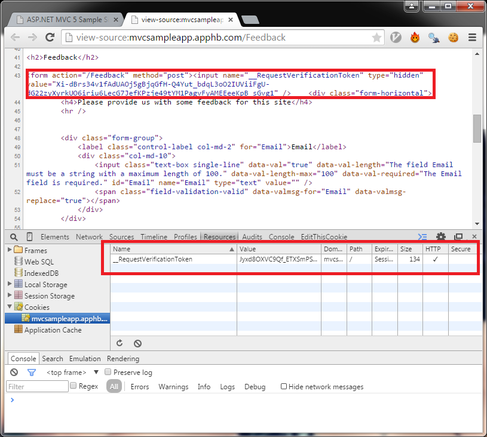

Cross Site Request Forgery, or CSRF as its often known, is a common security vulnerability which describes an attacker attempting to cause state changes on a server by tricking a victim into sending an undesired request from an authenticated session without them knowing. Well thats all great, but what does it actually mean...

### Typical Scenario

A typical scenario would be an attacker trying to change an email address on a system so that they can gain access:

1.  An attacker uses social engineering to send a link to a victim by email.
2.  The victim clicks the link not realizing that it has a hidden request to a CSRF vulnerable site.
3.  The page that the attacker linked to has a specially crafted request in it that will get sent to the target application when the page loads.
4.  When the dodgy page is loaded, the victims browser  will automatically post the form sending any cookies, credentials and IP information to the target application.
5.  The vulnerable application has no way of knowing if that this is not a valid request, because all the correct information is included.
6.  The email address has been changed to an account that the attacker has access to. By using the password reset of the target site, can access the service using the stolen account.

The flaw requires the victim to already be authenticated on the target application and relies on the fact that the browser will automatically include session information, IP Address and windows credentials in the request without the victim evening knowing. Also, as the attacker has no way of seeing the response, this attack typically targets a change of state on the server, rather than trying to steal data. For example, the attacker would aim to change an email address or transfer funds in a banking system.

### Protecting Against this Attack in MVC 5

Its really easy to protected against this attack in MVC 5. The framework provides some sample tags.

1.  Use the Html helper to generate the required client side tokens:
    ```csharp
    @using (Html.BeginForm("Index", "Feedback"))
    {
    @Html.AntiForgeryToken()
        <!-- form controls -->
    }

````


2.  Decorate the controller with the ValidateRequestForgery request:
    ```csharp
[HttpPost]
[ValidateAntiForgeryToken]
public ActionResult Index(FeedbackModel model)
{
    // Controller code
}
````

So now, a token has been generated both in a hidden input field on the form AND as a cookie. If BOTH of these values are not present in the request, and with matching values then  a [HttpAntiForgeryException](https://msdn.microsoft.com/en-us/library/system.web.mvc.httpantiforgeryexception%28v=vs.111%29.aspx) is thrown by the framework and the controller in question is not executed.



### Useful Links

- Troy Hunt has an excellent description of [CSRF in action with examples](http://www.troyhunt.com/2010/11/owasp-top-10-for-net-developers-part-5.html). 
- Also see the [OWASP page for details](<https://www.owasp.org/index.php/Cross-Site_Request_Forgery_(CSRF)>) 
- And for prevention see the [OWASP prevention Cheat Sheat](https://www.owasp.org/index.php/CSRF_Prevention_Cheat_Sheet)
- I've put together a sample site for testing this: [mvcsampleapp.apphb.com/Feedback](http://mvcsampleapp.apphb.com/Feedback)
