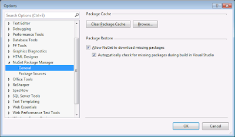
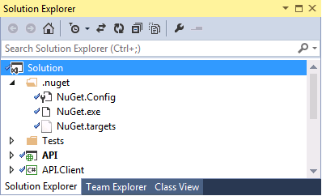

There are three ways that Nuget updates packages:

- Automatically
- MSBuild-Integrate
- Using the command line

### Automatically

As of Nuget version 2.7 the package restore should just all work! There are two settings which when checked means that new packages will automatically be downloaded when you build your solution.



For more information see [Automatic Package Restore in Visual Studio](https://docs.nuget.org/consume/package-restore#automatic-package-restore-in-visual-studio) on [nuget.org](http://nuget.org/)

### MSBuild-Integrate

Previously, you had to right click and Enable Nuget Package Restore from the context menu, which resulted in the Nuget exe actually being added to the solution, along with some config.



So if you see a solution with these files, its actually a legacy approach to Nuget, it should use the previous method mentioned above.

For more information see [MSBuild Integrated Package Restore](https://docs.nuget.org/consume/package-restore#msbuild-integrated-package-restore) on [nuget.org](http://nuget.org/)

### Problems with Automatic Restore

So sometimes when your working in an old solution and, for example, moving a project out to a nuget package, you might get an error something like:

    _Error 1 This project references NuGet package(s) that are missing on this computer_

Visual Studio will automatically assume that it is using the old method if it detects the additional nuget files. But be aware, the project in question will also have the following xml in the project file. So, even if these extra nuget files don't exist, you may have managed to get into the state where that error appears. You just need to remove the Xml from the csproj file:

```xml
<Import Project="$(SolutionDir)\.nuget\NuGet.targets" Condition="Exists('$(SolutionDir)\.nuget\NuGet.targets')" />
<Target Name="EnsureNuGetPackageBuildImports" BeforeTargets="PrepareForBuild">
  <PropertyGroup>
    <ErrorText>This project references NuGet package(s) that are missing on this computer. Enable NuGet Package Restore to download them.  For more information, see http://go.microsoft.com/fwlink/?LinkID=322105. The missing file is {0}.</ErrorText>
  </PropertyGroup>
  <Error Condition="!Exists('$(SolutionDir)\.nuget\NuGet.targets')" Text="$([System.String]::Format('$(ErrorText)', '$(SolutionDir)\.nuget\NuGet.targets'))" />
</Target>
```

You also need to remove the *<RestorePackages>true</RestorePackages>* line from the relevant property group. Source: [Migrating MSBuild-Integrated solutions to use Automatic Package Restore](https://docs.nuget.org/consume/package-restore/migrating-to-automatic-package-restore)

### Command Line Restore

From the command line, your using the nuget.exe directly, for example:    *nuget.exe restore my-application.sln* For more information see [Command Line Package Restore](https://docs.nuget.org/consume/package-restore#command-line-package-restore) on [nuget.org](http://nuget.org/)
