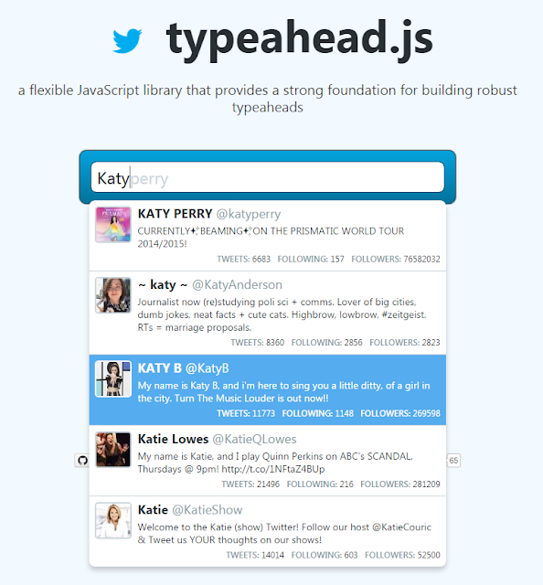

Twitter's typeahead JQuery plugin provides excellent auto suggest functionality that you can use on text boxes. It transforms a rudimentary lookup facility into a very useful search tool. There's a great example on the [project homepage](https://twitter.github.io/typeahead.js/)...



### Getting Started

I did  find it a bit confusing to get started with the control. There is a lot of documentation and some good examples, but I couldn't quite find what I wanted to do. Stackoverflow to the rescue:

- [typeahead examples](http://twitter.github.io/typeahead.js/examples/)
- [typeahead documentation](https://github.com/twitter/typeahead.js/blob/master/doc/jquery_typeahead.md)
- [Bloodhound documentation](https://github.com/twitter/typeahead.js/blob/master/doc/bloodhound.md#api)
- [Stackoverflow example](http://stackoverflow.com/questions/25029022/using-typeahead-js-with-asp-net-webapi)

Looking through the basic example, the function substringMatcher does the work that I thought typeahead did. That's because...

   "_the source of a dataset is responsible for computing a set of suggestions for a given query_"

This is where the Bloodhound engine comes in. Bloodhound is a suggestion engine which does the heavy lifting. typeahead.js is a JQuery plugin for the UI, whereas the Bloodhound suggestion engine is used to prefetch data, provide caching and backfilling. You can get the [latest version](https://twitter.github.io/typeahead.js/releases/latest/typeahead.bundle.js) (0.11.1 at the time of writing) from the [project homepage](https://twitter.github.io/typeahead.js/).

### Simple Example

After playing around with the examples and the StackOverflow example, I eventually arrived at the following example code, which is also deployed to this [sample site](http://mvcsampleapp.apphb.com/Typeahead), and the full code is [on github](https://github.com/johnmmoss/MVC5SampleApp/tree/master/src).

```javascript
var bloodhound = new Bloodhound({
  datumTokenizer: Bloodhound.tokenizers.whitespace,
  queryTokenizer: Bloodhound.tokenizers.whitespace,
  remote: {
    url: baseUrl + "?q=%QUERY",
    wildcard: "%QUERY",
  },
});

bloodhound.initialize();

$("#bloodhound .typeahead").typeahead(
  {
    hint: true,
    highlight: true,
  },
  {
    name: "states2",
    displaykey: "state",
    source: bloodhound.ttAdapter(),
  },
);
```

So the baseurl is a setting in the web.config (StatesApiUrl) which points to an controller action that returns all the states of america. The typeahead control is the same html as the typeahead examples.

### Typeahead Bug

There was some random behavior with the typeahead plugin, it didn't seem to work. If I typed "w" I only got Washington back, not the four entries that there should be. And when I typed an "o" I got two results back, but not Oregon for some reason! Turns out there's a bug with typeahead in version 0.11.1 and you can read full details and how to correct it in [Issue 1218 Remote Completion](https://github.com/twitter/typeahead.js/issues/1218). If you [review this commit](https://github.com/johnmmoss/MVC5SampleApp/commit/5550ed881c185aa6b1a9e4d671a2f2e09378562d), you can see the changes that I made to fix this bug.
