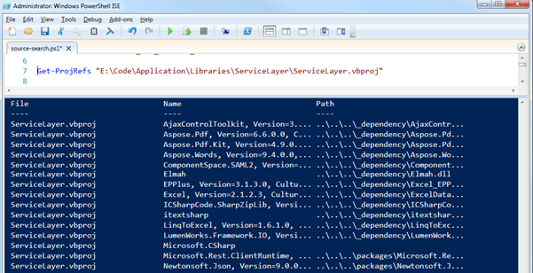

Most companies have some pretty complicated legacy code bases with a multitude of applications and shared libraries. It can be quite difficult to see how the solutions and projects fit together. With the push towards devops and microservices it’s nice if we can carry some of the legacy applications along too. I’ve found PowerShell a useful way to try to reason about a code base... In the first instance, a simple command gets you started...

```powershell
gci -Path E:\Code\ -Filter *.sln -Recurse | select Name, FullName
```

With a list of solutions we can now select one to view the projects using some regex hackery...

```powershell
$lines = select-string -Path E:\Code\Application\Websit1.sln -Pattern "^Project.*"
$lines | % {
    $pattern = "Project.*=\s`"([^`"]*)`", `"([^`"]*)"
    if ([Regex]::IsMatch($_.Line, $pattern) ) {

        $matches = [Regex]::Matches($_.Line, $pattern)

        $name = $matches[0].Groups[1].Value
        $path = $matches[0].Groups[2].Value

        $object = New-Object –TypeName PSObject
        $object | Add-Member -MemberType NoteProperty –Name Name –Value $name
        $object | Add-Member –MemberType NoteProperty –Name Path –Value $path
        $object | Add-Member –MemberType NoteProperty –Name FullPath –Value “E:\Code\$path”

        $object
    }
}
```

Now we want to see what the project file is referencing. This is where it gets interesting, because invariably legacy projects have dlls checked into source control. As a result the projects will be referencing a hard coded location on disk, rather than Nuget...

```powershell
[xml] $axml= Get-Content E:\Code\Library\DataLayer.csproj
$ns = new-object Xml.XmlNamespaceManager $axml.NameTable
$ns.AddNamespace("d", "http://schemas.microsoft.com/developer/msbuild/2003")
$nodes = $axml.SelectNodes( "/d:Project/d:ItemGroup/d:Reference", $ns)

foreach ($node in $nodes) {
   $object = New-Object –TypeName PSObject
   $object | Add-Member -MemberType NoteProperty –Name File –Value (split-path $path -leaf)
   $object | Add-Member –MemberType NoteProperty –Name Name –Value $node.Include
   $object | Add-Member –MemberType NoteProperty –Name Path –Value $node.HintPath

   $object
}
```

This time round we are parsing the XML directly and returning a custom PowerShell object which includes the data we need. In the results below, we can see some references to a \_dependency folder, presumably these are checked into source control. We can also see the packages folder referenced as well as a single blank Path – this is a .NET framework library:



This final script is useful to see which solutions have a particular project referenced.

```powershell
gci -Path E:\Code -Filter *.sln -Recurse  |  % {
  $exists = (select-string "^Project.*`"$ProjectName`"" $_.FullName).Matches.Count

  if ($exists -gt 0) {
      write-host $_.FullName   -ForegroundColor green
  } else {
      write-host $_.FullName -ForegroundColor gray
  }
}
```

The write-host commands are useful if the code base is quite large, because the search will take a long time and its good to see whats being processed. There is a complete script on [github](https://github.com/johnmmoss/Scrapbook/blob/master/Powershell/VS-FileSearch.ps1) with the code above wrapped in functions. Happy searching :)
