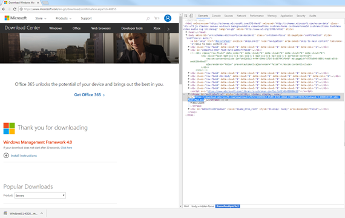
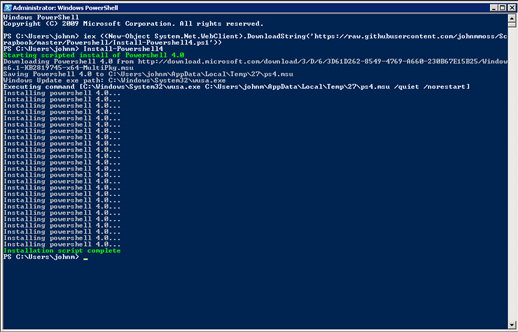

I got a bit fed up with upgrading PowerShell on a number of different servers so decided to write a script to automate the task. I appreciate that it doesn’t take long to click download and install but after using chocolatey you start to realise how easy it can actually be with a little bit of effort. At the time of writing the current release of PowerShell is actually [version 5](https://www.microsoft.com/en-us/download/details.aspx?id=50395), however, I wanted to standardise the environments for the deployment pipeline at my company and due to the legacy systems it ended up being version 4 rather than 5. So when I say like chocolatey, what I mean is the ability to execute a single iex command from a PowerShell window that downloads the executable and then executes it silently as a background job rather than starting a GUI. The PowerShell 4 install requires a reboot, but I don’t want to do the reboot as part of the script because I may actually go on to run other scripts or defer the reboot to a later time – remember this is to upgrade servers so we may want to run the script in the day but schedule an out of hours reboot. Well, we have our spec, so first things first, where do I get the executables from? PowerShell is actually known as the Windows Management Framework in Microsoft parlance, so the first thing to do is dig out the direct link to the installer. The [download page](https://www.microsoft.com/en-gb/download/confirmation.aspx?id=40855) is actually a wizard, so click to download and use chrome developer tools to dig out the link to the installer.



There are two different versions of the installer 32bit and 64bit:

1.  [Windows6.1-KB2819745-x86-MultiPkg.msu](https://download.microsoft.com/download/3/D/6/3D61D262-8549-4769-A660-230B67E15B25/Windows6.1-KB2819745-x86-MultiPkg.msu)
2.  [Windows6.1-KB2819745-x64-MultiPkg.msu](http://download.microsoft.com/download/3/D/6/3D61D262-8549-4769-A660-230B67E15B25/Windows6.1-KB2819745-x64-MultiPkg.msu)

Next, how to execute the install silently? Silent installation is quite a common thing to do, but actually google didn’t return to many results until I passed the actual name of the downloaded package. This returned a site called [manageengine.com](<https://www.manageengine.com/products/desktop-central/software-installation/silent_install_Windows-Management-Framework-4.0-(x64).html>) which has commands for quite a few installation packages. This site listed the command as: $windir\\System32\\wusa.exe Windows6.1-KB2819745-x64-MultiPkg.msu /quiet /norestart Cool, so we know the URL and we know the command, pretty much there. I want to check the PowerShell version installed before going ahead with the update as a bit of error checking… no sense in running the installer unnecessarily. Then just download the exe file using the WebClient DownloadString method and save to the temp directory and execute the command using the Invoke-Expression cmdlet. We can use the PowerShell environment variables temp and windir to reference the local filesystem without making assumptions about file locations:

```powershell
$currentPsVersion = (get-host).Version.Major;

if ((get-host).Version.Major -ge 4) {
    write-host Powershell version $currentPsVersion is already installed -ForegroundColor Red
    return;
}

$ps4DownloadUrl = "http://download.microsoft.com/download/3/D/6/3D61D262-8549-4769-A660-230B67E15B25/Windows6.1-KB2819745-x64-MultiPkg.msu"
$ps4LocalPath = "$env:temp\ps4.msu"
$wusaPath = "$env:windir\System32\wusa.exe"

((New-Object System.Net.WebClient).DownloadFile($ps4DownloadUrl, $ps4LocalPath))

$command = "$wusaPath $ps4LocalPath /quiet /norestart"

iex ($command)
```

So far so good, but we don’t get much feedback from the console while that’s running, and the update does take a while. Examining the running processes we see that the Windows Update Standalone Installer process is running throughout the update. The process is listed as wusa.exe so it’s relatively trivial too periodically list the running processes and see if this exe is still running. The code looks like this:

```powershell
do {

    write-host Installing powershell 4.0...  -ForegroundColor Gray

    start-sleep -s 10

} while ((get-process | where { $_.ProcessName -eq "wusa" }) -ne $Null)
```

I have a completed script in [github](https://github.com/johnmmoss/Scrapbook/blob/master/Powershell/Install-Powershell4.ps1), which wraps these snippets into a complete function. The function takes a switch for 32bit selecting the URL appropriately. If you click the [raw link](https://raw.githubusercontent.com/johnmmoss/Scrapbook/master/Powershell/Install-Powershell4.ps1), you get the just the script from github without any UI, and this can be used to download and invoke in a PowerShell window: iex ((New-Object System.Net.WebClient).DownloadString('https://raw.githubusercontent.com/johnmmoss/Scrapbook/master/Powershell/Install-Powershell4.ps1')) This will create the function Install-Powershell, so now we just need to execute it... Install-Powershell4 Following the scripts completion you need to reboot before the install is complete but once done, you should be able to access PowerShell ISE and use version 4. So running this command in a PowerShell window looks like so.



Nice! I've used this script quite a few times and its great to think that extra bit of effort has saved me quite a bit of time and faff. Admittedly its going to be of limited use in the future, but the techniques can be reused for other installations also.
