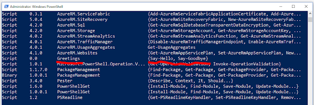
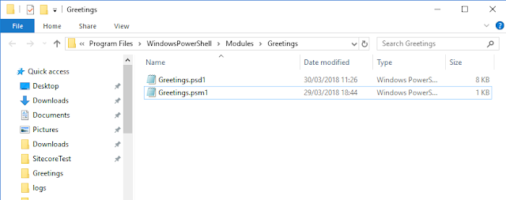

Powershell is a very powerful tool for automating tasks. Creating your own nuget repository that hosts powershell modules is a great way to distrubute powershell scripts, but it can be a bit fiddly to setup. When creating your own modules, it can be quite fiddly to actually get them setup on a central repository. Nuget repos natively support powershell modules so its actually quite straight forward once they are setup. Its just a case of knowing the right sequence of commands to get setup and connected to the repository source.

The basic steps are:

1.  Create a powershell script
2.  Save as a .psm1 file in one of the module path directories
3.  Create a Module Manifest
4.  Load the module into the current session
5.  Push the module to a remote nuget repository

### Creating a basic Script

The first couple of steps are as simple as they sound. Create a simple function and save it as a powershell script. For example: 

```powershell
function Say-Hello() {

	write-host Hello! -ForegroundColour green
}

function Say-Goodbye() {

	write-host Goodbye! -ForegroundColour red
}
```

Run the following command to see where the environment module paths are:

   *$env:PSModulePath.Split(';')*

On my system this meant that the following directory was a module path:

   C:\\Program Files\\WindowsPowerShell\\Modules

Once the psm1 file is saved to this directory, you can see it in your powershell session by running:

   Get-Module -ListAvailable

The module will be displayed in the list:



### Creating a Module Manifest

You will notice in the above screenshot that the version is set to 0.0. In order to set this and other metadata you can create a module manifest. The module manifest is an array of data in a seperate psd1 file with the same name as the module. You can create one using the following cmdlet: New-ModuleManifest -Path '<path-to-manifest>.psd1'   
          -RootModule '<module-name>.psm1' -Author 'me' Here's an example for our Greetings.psm1

```powershell
New-ModuleManifest -Path "C:\Program Files\WindowsPowerShell\Modules\Greetings\Greetings.psd1"
    -RootModule 'Greetings.psm1'
    -Author 'John Moss'
```

Once run, you should see the new psd1 file in the output directory:



### Loading the Module

We have now created our module and it is on our local system and if we re-run Get-Module we should see it, now with the version number set. We can import that module into the session and start calling the methods on it like any other module.    import-module Greetings

### Push to Remote Repository 

Before we can push the module we need to setup the repositorys. Because I am using TFS as a source, I actually need to setup both the nuget sources and the PowershellGet PSRepositorys. Once these have both been added, we can then call the publish-module command. Publish-Module calls Publish-PSArtifact.

```powershell
# Add TFS Package Management Source for Nuget
nuget.exe sources add -name Powershell -source http://url/to/package/repo/index.json -username VSTS -password "pat-from-tfs" -storePasswordInClearText

# Register the PowershellGet source
Register-PSRepository  -Name Powershell -SourceLocation  http://url/to/package/repo/index.json -PackageManagementProvider NuGet  -PublishLocation http://url/to/package/repo/index.json  -InstallationPolicy Trusted -Credential Get-Credential

# Finally we can push the loaded module to our TFS Repository
Publish-Module -Name Greetings -Repository Powershell -NuGetApiKey "pat-from-tfs" -Credential Get-Credential
```
