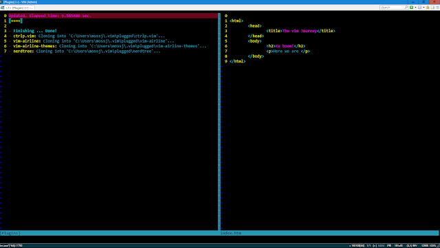
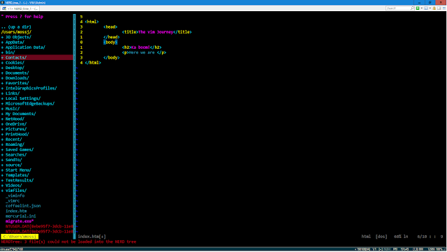

I've been using VsVim the vim Visual Studio plugin and I really like how much easier it makes coding when your fingers can live on the home keys more. Recently I started working through Roy Osheroves [Vim Hates You](https://youtu.be/oOKfu5OPlFs) course and learning loads more tricks and ways to use vim, so I thought I would put a bit of effort into learning vim int the console so that it might in the future it might become my main weapon of choice.

### Preliminaries

I use [ConEmu](https://conemu.github.io/) on windows at the moment. I've started scripting in powershell and trying to use the command line a bit more. As Im a .NET developer, I think Visual Studio is the best IDE to use for day to day coding, but for anything else there is the potential to use vim.

### Vim Plugins

I found setting up vim plugin managers on windows a real pain in the arse last time I tried it. But following the instructions on Roy's course and using vim-plug it actually seemed really straight forward and worked first time.

### 1\. Install vim-plug 

This is as simple as running the powershell script on [vim-plug](https://github.com/junegunn/vim-plug) home page. This puts the Add in the plugin commands to your vimrc file.

### 2\. Configure vim-plug

In windows, instead of .vimrc its \_vimrc, but you do still have access to the $HOME variable, hence the following line will open your \_vimrc in     _vim $HOME\\\_vimrc_ Again, the documentation is good onthe vim-plug home page, but heres what I added in my \_vimrc to get some of the more popular plugins setup:

```

 " Begin vim-plug extensions
 call plug#begin('~/.vim/plugged')

          Plug 'bling/vim-airline'
          Plug 'vim-airline/vim-airline-themes'
          Plug 'kien/ctrlp.vim'
          Plug 'scrooloose/nerdtree'

call plug#end()

set noswapfile
set relativenumber
set incsearch

filetype indent on
syntax enable

set shell=powershell
set shellcmdflag=-command
```

### 3\. Run PlugInstall

Once the plugin manager is downloaded to the correct directory and the configuration added to \_vimrc, we now run the :PlugInstall command from with in vim. This will cause the vim-plug to initiate and download all the plugins install them to the appropriate directories.



The right pane is the vim file I originally appended. Then run :PlugInstall and the left hand window opens and displays the progress of the install. On complete, type :qa to close all, and then open vim again. Now you have access to plugins installed.



### Summary

The first time I tried to setup a vim plugin manager, it was a bit of a frustrating task. The VimHatesYou video series has been an excellent guide to help me get from novice to more advanced user and I was pleasantly surprised with how easily the vim-plug plugin manager just works. Nice and simple. And yes, I really need to sort my theme out, its making my eyes bleed.
