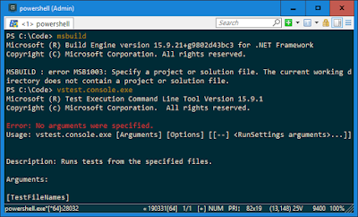

In my previous post I talked about setting up vim plugins. I've been using vim on the commandline quite a bit now and have found a couple of useful commands that I like to have setup to make use a bit easier.

### The Powershell $profile

Powershell has the $profile variable which is a path to the Microsoft.Powershell_profile.ps1 in the users home directory. Every time you open a console, this script runs so any code you add in can setup your environment. Initially this script doesn't actually exist, so you need to create it:    *New-Item $profile* Once created you can edit it like any other file:    vim $profile The next section gives some examples for a script.

### Example $profile Script

```powershell
import-module DevProjectTools

# Edit this file
function Edit-Profile() {
	vim $profile
}

# Edit the vimrc file
function Edit-Vimrc() {
	vim $HOME\_vimrc
}

# Open the (first) PS Module folder
function Open-PSModuleFolder() {
	start $env:PSModulePath.Split(";")[0]
}

# Copy current path to the clipboard
function Copy-Path() {
	(pwd).Path | clip
}

# Set the prompt: PS: NgApp1 [feature/add-customers-grid] >
function prompt
{
	$current = pwd | split-path -leaf
	$branch = git rev-parse --abbrev-ref HEAD
	$output = $current;
	if ($branch) {
		   $output = "$current [$branch]";
	}
	Write-Host ("PS: $output >") -nonewline
	return " "
 }

# Edit Angular Web project in vs code
function Edit-StatementsTrackerWeb () {
 code "C:\Code\poc-project\StatementsTrackerWeb"
}

# Edit the StatementsTrackerWeb solution in Visual Studio
function Edit-StatementsTrackerWeb () {
	start "C:\Code\poc-project\SimpleTokenService\SimpleTokenService.sln"
}

# Run some unit Tests
function Run-StatementsApiUnitTests() {
	vstest.console.exe "$code\StatementsTracker\Api\bin\Debug\Api.UnitTests.dll"
}

# Start an angular app
function Start-StatementsWeb() {
	start powershell.exe "npm --prefix $code\Statements\Web start"
}

$code = "C:\Code"
$statementsTrackerWeb = "C:\Code\StatementsTrackerWeb";
$statementsTrackerApi = "C:\Code\StatementsTrackerApi";

cd $code
```

- Working on projects, I like to create a powershell module that can be used to run tests, open solutions, update databases etc I can manage this code easier in a module and also share this with my colleagues.
- Helper methods for editing this profile and the vimrc
- The Copy-Path method speeds up the adding of new edit methods.
- Starting an angular app in another powershell process.
- Run acceptance tests (see next section)
- Simple variables provide ways of navigating code and 

### Additional Setup

When we start using the console a lot, one of the biggest challenges is actually just getting applications to run for there, like msbuild and test console. Add the following to your path directory and that should mean you can run msbuild.exe and vstest.console.exe

- _C:\\Program Files (x86)\\Microsoft Visual Studio\\2017\\Professional\\MSBuild\\15.0\\Bin_
- _C:\\Program Files (x86)\\Microsoft Visual Studio\\2017\\Professional\\Common7\\IDE\\CommonExtensions\\Microsoft\\TestWindow_

The idea here is that once we can get these commands working on the command line, we can add them into scripts


