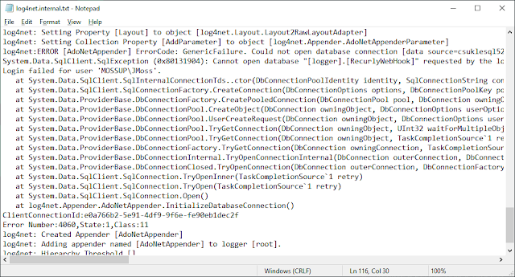

Turning on internal logging for log4net is straight forward and provides a detailed information about the many issues that may occur. Add in Debug App Setting  
There is only two things that you need to do... first up add in the following app setting: _\<add key="log4net.Internal.Debug" value="true"/\>_

### Add in Trace Listener

Next, we add in the config that sets up the trace listener which outputs to the file:

```xml
<system.diagnostics>
  <trace autoflush="true">
    <listeners>
      <add
        name="textWriterTraceListener"
        type="System.Diagnostics.TextWriterTraceListener"
        initializeData="C:\Users\jmoss\Desktop\log4net.txt" />
    </listeners>
  </trace>
</system.diagnostics>
```

These are the two changes and when you restart your application you should see the logs being output to the file specified in the trace listener. Here is a complete example of an App.config from a sample console application:

```xml
<?xml version="1.0" encoding="utf-8" ?>
<configuration>
  <configSections>
    <section name="log4net" type="log4net.Config.Log4NetConfigurationSectionHandler, log4net"/>
  </configSections>
  <appSettings>
    <add key="log4net.Internal.Debug" value="true"/>
  </appSettings>
  <log4net configSource="log4net.config"/>
  <startup>
        <supportedRuntime version="v4.0" sku=".NETFramework,Version=v4.7.2" />
  </startup>
  <system.diagnostics>
    <trace autoflush="true">
      <listeners>
        <add
          name="textWriterTraceListener"
          type="System.Diagnostics.TextWriterTraceListener"
          initializeData="C:\Users\jmoss\Desktop\log4net.txt" />
      </listeners>
    </trace>
  </system.diagnostics>
</configuration>
```

Note that I have set the file location to output the file to my desktop, this is because...

### File Permission Errors

On IT Systems at companies it is often the case that you dont have access to write to the C drive. The frustrating thing about log4net is that it will fail silently for configuration issues so you can spend hours trying to figure out what's wrong and its especially annoying when setting up internal logging as there are only two things to add to turn it on. Once the logging is setup you get a nice detailed trace and fixing up the log4net configuration becomes a lot simpler:



Reference: [https://haacked.com/archive/2006/09/27/Log4Net_Troubleshooting.aspx/](https://haacked.com/archive/2006/09/27/Log4Net_Troubleshooting.aspx/)
