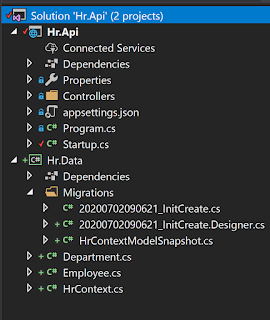

I while ago, I posted about setting up Entity [Framework 6 Code First migrations](http://mossup.blogspot.com/2015/02/getting-started-with-entity-framework.html) in an MVC 5 Project. These days, its all about dotnet core, and whilst the process is very similar, I thought I would write another detailed walk through so that I can hit the ground running when I'm required to do this working on real projects.

#### Project Setup

Start off by creating a dotnet core API using Visual Studio 2017. Add a dotnet core class library to the project. For this tutorial I used [dotnet core 2.2.0](https://dotnet.microsoft.com/download/dotnet-core/2.2). Reference the following nuget packages for BOTH projects. Make sure that you select the version that matches your dotnet framework version (e.g. 2.2.0)

- Microsoft.EntityFrameworkCore
- Microsoft.EntityFrameworkCore.SqlServer

And reference the following package for the Data project

- Microsoft.EntityFrameworkCore.Design

Finally, add a reference to the Data project from the Api project.

#### Create the Model

Add in an Employee, Department and Context class to the Data project and copy the code across from each of the classes listed below:

```csharp
public class AcmeContext : DbContext
{
    public AcmeContext(DbContextOptions<AcmeContext> options)
              : base(options)
    {
    }

    public DbSet<Employee> Employees { get; set; }
}

public class Employee
{
    [Key]
    [DatabaseGenerated(DatabaseGeneratedOption.Identity)]
    public int EmployeeID { get; set; }

    [Column(TypeName = "date")]
    public DateTime BirthDate { get; set; }

    [StringLength(8)]
    public string Title { get; set; }

    [Required]
    [StringLength(50)]
    public string FirstName { get; set; }

    [Required]
    [StringLength(50)]
    public string LastName { get; set; }

    [Range(1, int.MaxValue, ErrorMessage = "Please select a valid Department")]
    public int DepartmentID { get; set; }
    public Department Department { get; set; }
}

public class Department
{
    [Key]
    [DatabaseGenerated(DatabaseGeneratedOption.Identity)]
    public int DepartmentID { get; set; }

    [Required]
    [StringLength(50)]
    public string Name { get; set; }

    [Required]
    [StringLength(50)]
    public string GroupName { get; set; }
}
```

We also need to register the Entity Framework in the Startup.cs class. Add the following two lines to the ConfigureServices method of the Startup.cs class. Update the connection string to match your SQL Server:

```csharp
var connectionString = "Server=(local)\\sqlexpress;Initial Catalog=AcmeDatabase;Persist Security Info=False; integrated security=True";
services.AddDbContext<AcmeContext>(o => o.UseSqlServer(connectionString));
```

Now we can run the powershell commandlets to create the migration and also create the database on the server. Open the package manager console by going to View -> Other Windows -> Package Manager Console. This console is a powershell terminal and the Entity Framework commandlets were installed when the EntityFrameworkCore Design nuget package was installed:    Add-Migration InitCreate  
   Update-Database The add migration command will create the migrations and add them to your project and the update database command actually runs the migrations against the Sql Server, creating the database and associated tables. In the screenshot below you can see  an outline of the solution so far:



EntityFramework Core is now setup in the project and we can add a controller to the Api to get some of the employees out of the database. Obviously, the database is empty initially, but you can manually add some Employees in using Sql Management Studio. Add the following controller code to the Api project and run the solution. The employees that you manually added to the database will be returned in the api call:

```csharp
[Route("api/[controller]")]
[ApiController]
public class EmployeeController : ControllerBase
{
    private readonly HrContext _hrContext;

    public EmployeeController(HrContext hrContext)
    {
        _hrContext = hrContext;
    }

    [HttpGet]
    public ActionResult Get()
    {
        var employees = _hrContext.Employees.ToList();

        return Ok(employees);
    }
}
```
