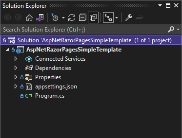
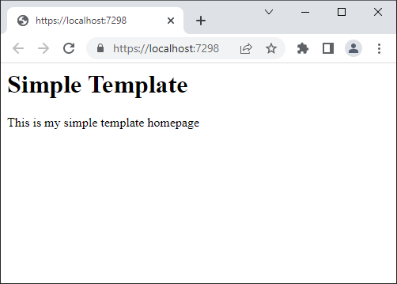
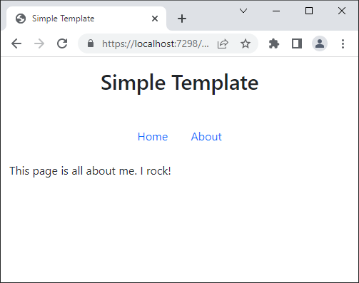
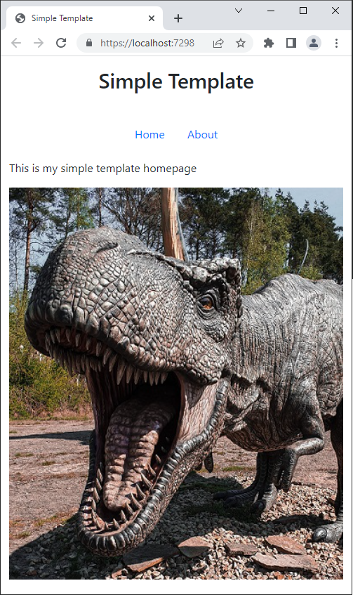
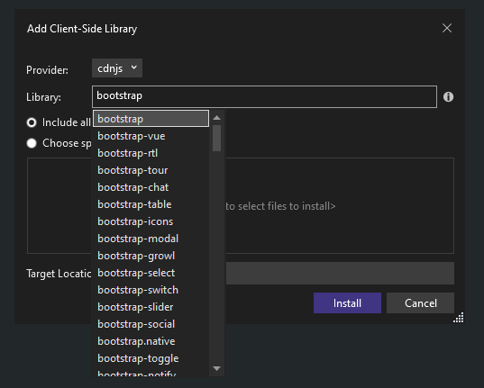
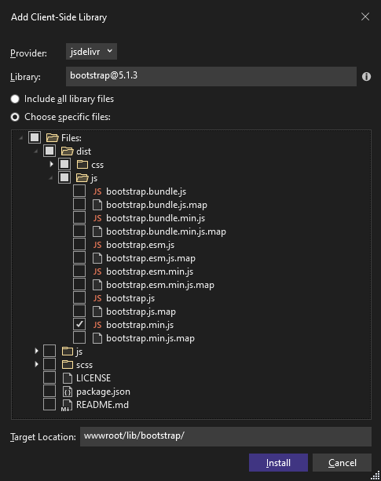
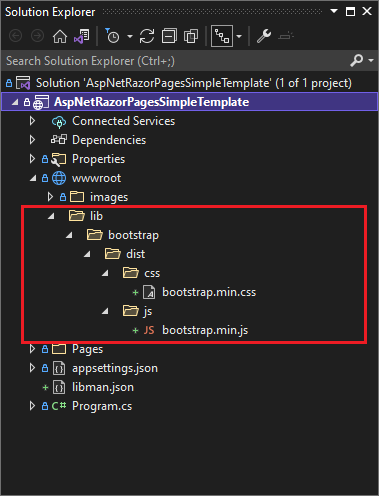
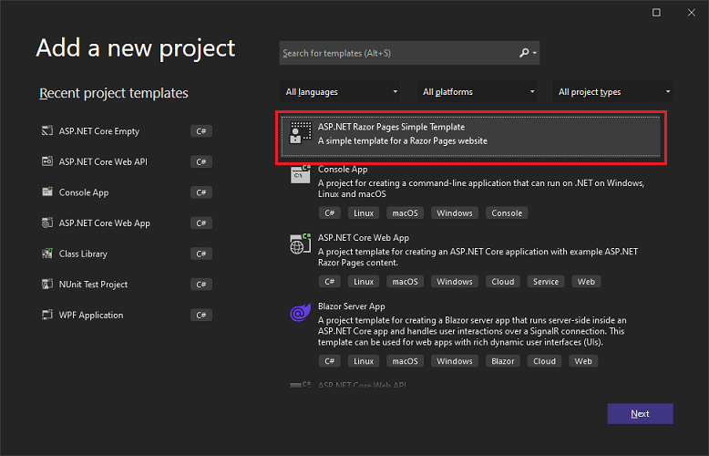

Visual Studio 2022 provides a template for creating an empty ASP.NET Core application. Although this template requires a bit of work to get a Razor Pages website up and running, by using the empty template we can include only the libraries and template code that we actually need.

Before we begin, if you just want to get a full site up and running quickly you can use the **ASP.NET Core Web App** template rather than following this tutorial. This tutorial is useful when you want to avoid the additional bloat that comes with that template.

### ASP.NET Core Empty Template

The .NET 6 empty template contains an impressive lack of code and, although it doesn't do much, it is still actually a valid working website. The basic empty solution is shown below:



The code in `program.cs` while minimal does actual set quite a few defaults

```csharp
var builder = WebApplication.CreateBuilder(args);
var app = builder.Build();

app.MapGet("/", () => "Hello World!");

app.Run();
```

Its beyond the scope of this article to discuss the inner workings of the template code, however Andrew Lock's post [Comparing WebApplicationBuilder to the Generic Host](https://andrewlock.net/exploring-dotnet-6-part-2-comparing-webapplicationbuilder-to-the-generic-host/) explains the somewhat complex history of how this code came to be.

### Setting Up Razor Pages

In order to setup our website to serve Razor Pages, we need to update the `Program.cs` and also add a Razor Page to actually serve.

#### Update `Program.cs`

We need to enable Razor Pages via the `WebApplicationBuilder`, and then setup routing using the `WebApplication` methods:

- AddRazorPages
- UseRouting
- MapRazorPages

With our new methods added, our new `Program.cs` looks like:

```csharp
var builder = WebApplication.CreateBuilder(args);
builder.Services.AddRazorPages();
var app = builder.Build();

app.UseRouting();
app.UseEndpoints(endpoints =>
{
    endpoints.MapRazorPages();
});

app.Run();
```

#### Add a Razor Page

Create a new directory `Pages` and add a new Razor Page called `Index.cshtml`. The content is not too important, but as an example:

```asp
@page
@model AspNetRazorPagesSimpleTemplate.Pages.IndexModel

<h1>Simple Template</h1>

<p>This is my simple template homepage</p>
```

Once these two steps are complete we can run the code and our Simple Template website will now display a slightly more detailed message:



Fantastic, now we can serve Razor Pages! Next we will add the shared layouts that complete the initial setup of our ASP.NET website.

### Setting Up Shared Layouts

The following shared views setup a standard view for all pages and enable [Tag Helpers](https://docs.microsoft.com/en-US/aspnet/core/mvc/views/tag-helpers/intro?view=aspnetcore-6.0) for use in our Razor syntax. You can read more about layouts on the MSDN article [Layout in ASP.NET Core]().

- Pages/Shared/\_Layout.cshtml
- Pages/\_ViewImports.cshtml
- Pages/\_ViewStart.cshtml

**Note** these files are actually Razor Views NOT Razor Pages. A Razor View is a single `.cshtml` file, a Razor Page consists of a view AND a code behind file, a `.cshtml.cs` file, associated with it.

#### Add a Shared Layout View

So first up lets add the `_Layout.cshtml` view into a new folder at `Pages/Shared`. We will use Bootstrap as our UI framework so, lets add some basic markup to create a simple layout shared to be used by all our Razor Pages:

```html
<!doctype html>
<html lang="en">
  <head>
    <meta charset="utf-8" />
    <meta name="viewport" content="width=device-width, initial-scale=1" />
    <title>Simple Template</title>
    <link
      rel="stylesheet"
      href="https://cdn.jsdelivr.net/npm/bootstrap@5.2.0-beta1/dist/css/bootstrap.min.css"
      integrity="sha384-0evHe/X+R7YkIZDRvuzKMRqM+OrBnVFBL6DOitfPri4tjfHxaWutUpFmBp4vmVor"
      crossorigin="anonymous"
    />
  </head>
  <body>
    <div class="d-flex justify-content-center mb-3 mt-3">
      <h1>Simple Template</h1>
    </div>
    <div class="container">
      <header class="d-flex justify-content-center py-3">
        <ul class="nav nav-pills">
          <li class="nav-item">
            <a class="nav-link" asp-area="" asp-page="/">Home</a>
          </li>
          <li class="nav-item">
            <a class="nav-link" asp-page="/about">About</a>
          </li>
        </ul>
      </header>
    </div>
    <main role="main" class="container">@RenderBody()</main>
    <script
      src="https://cdn.jsdelivr.net/npm/bootstrap@5.2.0-beta1/dist/js/bootstrap.bundle.min.js"
      integrity="sha384-pprn3073KE6tl6bjs2QrFaJGz5/SUsLqktiwsUTF55Jfv3qYSDhgCecCxMW52nD2"
      crossorigin="anonymous"
    ></script>
    @await RenderSectionAsync("Scripts", required: false)
  </body>
</html>
```

Once again the html is not too important at this stage, but do include the `RenderBody` and `RenderSectionAsync` calls. These are both important parts of the layout. Also, you will notice that the our client libraries are being loaded from a CDN. We will look to manage our client libraries using a package manager in a future section.

**Note** the markup is based on the [Bootstrap 5.2 quickstart](https://getbootstrap.com/docs/5.2/getting-started/introduction/#quick-start)

#### Add a View Start page

Next we add the `_ViewStart.cshtml` view in the root of the `Pages` directory. This view sets our `_Layout.cshtml` to be used by default for all our Razor Pages, so we don't have to explictly set it in every page:

```asp
@{
    Layout = "_Layout";
}
```

#### Add a View Imports Page

Finally we add a `_ViewImports.cshtml` view in the root of the `Pages` directory, and add the content below. This enables the Razor [Tag Helpers](https://docs.microsoft.com/en-US/aspnet/core/mvc/views/tag-helpers/intro?view=aspnetcore-6.0) for our `.cshtml` pages:

```asp
@addTagHelper *, Microsoft.AspNetCore.Mvc.TagHelpers
```

Now that we have added our shared layout pages we can run the solution and we see our new website with the bootstrap styles applied. If you add another page called `About.cshtml` and add some text, you should see the same layout and styles automatically applied:



Well, our site is not going to win any awards but adding some images sure would make it look a lot better.

### Static Files

Images are known as static content. In order to be able to serve static content in our website we ned to enable it in the middleware. This is a straightforward call on our `WebApplication` class:

```csharp
app.UseStaticFiles();
```

The parameterless `UseStaticFiles` method overload marks the files in the `wwwroot` as servable, so we need to add a folder of that name. Its worth creating a subdirectory for all images, so add a new folder `wwwroot/images` at the solution root and drop in an image. Update the markup on the homepage to reference the image:

```asp
@page
@model AspNetRazorPagesSimpleTemplate.Pages.IndexModel

<div class="d-flex justify-content-center">
    <p>This is my simple template homepage</p>
    &nbsp;
    
</div>
```

If you have added a file called `trex.jpg` and you run the solution, then you will see your image displayed. You can read more about static files in the msdn article [Static files in ASP.NET Core](https://docs.microsoft.com/en-us/aspnet/core/fundamentals/static-files?view=aspnetcore-6.0).



Now that we are able to serve static content, lets look into managing our client libraries using a package manager instead of a CDN.

### Manage Client Side Libraries

There are a lot of choices for client side package management. For simple scenarios using a Razor Pages website I opt for LibMan because it integrates nicely with Visual Studio and provides enough functionality for what we need.

For more information about LibMan review the MSDN article [Use LibMan with ASP.NET Core in Visual Studio](https://docs.microsoft.com/en-us/aspnet/core/client-side/libman/libman-vs?view=aspnetcore-6.0).

In order to add some client libraries, start by right clicking the csproj file and go to "Add" > "Client Side Library..." in the context menu. This opens up the "Add Client-Side Library" dialogue box. If we search for "bootstrap" as an example a drop down will be displayed with all bootstrap libraries found:



One of the features I like about libman is that you can choose just the files you need and do not have to download the whole package. For our simple scenario this is great way of keeping our solution clean and empty of bloat, although its probably not what we would do for more complex scenarios where we would want more control.

With bootstrap as an example, for more complex scenarios we might want to include the SASS so we can customize the output as described in [How to customize Bootstrap using Sass](https://www.mugo.ca/Blog/How-to-customize-Bootstrap-4-using-Sass). But for our simple scenario we just want to add the files we need:

- dist/css/bootstrap.min.css
- dist/js/bootstrap.min.js



On clicking the install button, the two selected files will be added to the solution at the "Target Location" specified in the previous dialogue. The file `libman.json` has also been added to the solution, which keeps track of the libraries that have been installed.



Along with Bootstrap there are several other client side libraries you might like to install:

- popper.js
- jquery
- moment.js

Once installed, we need to update the `_Layout.cshtml` page to reference the new client side libraries locally rather than from the CDN:

```html
<!doctype html>
<html lang="en">
  <head>
    <meta charset="utf-8" />
    <meta name="viewport" content="width=device-width, initial-scale=1" />
    <title>Simple Template</title>
    <link rel="stylesheet" href="~/lib/bootstrap/dist/css/bootstrap.min.css" />
  </head>
  <body>
    <div class="d-flex justify-content-center mb-3 mt-3">
      <h1>Simple Template</h1>
    </div>
    <div class="container">
      <header class="d-flex justify-content-center py-3">
        <ul class="nav nav-pills">
          <li class="nav-item">
            <a class="nav-link" asp-area="" asp-page="/">Home</a>
          </li>
          <li class="nav-item">
            <a class="nav-link" asp-page="/about">About</a>
          </li>
        </ul>
      </header>
    </div>
    <main role="main" class="container">@RenderBody()</main>
    <script src="~/lib/popper.js/umd/popper.min.js"></script>
    <script src="~/lib/bootstrap/dist/js/bootstrap.min.js"></script>
    <script src="~/lib/moment.js/moment.min.js"></script>
    <script src="~/lib/jquery/jquery.min.js"></script>
    @await RenderSectionAsync("Scripts", required: false)
  </body>
</html>
```

### Enable Restore Client Libraries

LibMan makes it possible to clean and build client side artefacts the similar to Nuget dependencies, but we need to enable this functionality.

The LibMan tool makes it possible to restore client libraries on build, so we don't need to commit the libraries to source control. We enable this feature by right clicking the `libman.json` file and selecting "Enable Restore Client-Side Libraries on Build... ". Click ok on the popup dialogue to say you are happy for the nuget package to be installed. To test this out, delete the `wwwroot/lib` folder and rebuild the solution and the new artifacts will be added as part of the build.

**Note** you will need to add this `wwwroot/lib` folder to your `.gitignore` file to ensure that it doesn't keep getting picked up by git.

Once we have enabled client restore as outline above, the client side artefacts will be downloaded on build. If you right click the `libman.json` file you will also see options to "Restore Client-Side Libraries" and "Clean Client-Side Libraries".

### Generating a Visual Studio Project Template

Visual Studio provides the functionality to create [Project Templates](https://docs.microsoft.com/en-us/visualstudio/ide/creating-project-and-item-templates?view=vs-2022). Once we have setup our simple template we can export it and resuse it by going to the Project menu and selecting Export Template. For more information review the article [How to: Create project templates](https://docs.microsoft.com/en-us/visualstudio/ide/how-to-create-project-templates?view=vs-2022).

Once you've gone through the tutorial our new template will be displayed in the add new project dialogue. If you



If you want to use this template, you can [download it here](https://github.com/johnmmoss/AspNetCore-Samples/raw/main/AspNetRazorPagesSimpleTemplate/Assets/ASP.NET%20Razor%20Pages%20Simple%20Template.zip) and copy it across to the Visual Studio templates directory:

- C:\Users\\**username**\Documents\Visual Studio 2022\Templates\ProjectTemplates

### Conclusion

In this article we started with the Visual Studio's ASP.NET Core Empty application template and added in the required middleware and layouts to setup a basic Razor Pages website. We then looked at using LibMan to manage the client side libraries and update our layout csthml to use those local client libraries. Finally we saw how we could create a Visual Studio Project Template which meant we can reuse this setup more easily in the future.

This approach avoids all the bloat that comes with the standard ASP.NET Core Web App and is useful for simple web scenarios ensuring that we are only deploying out what we actually need into the live environment.
