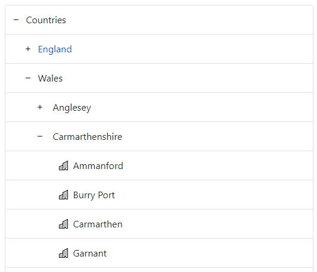
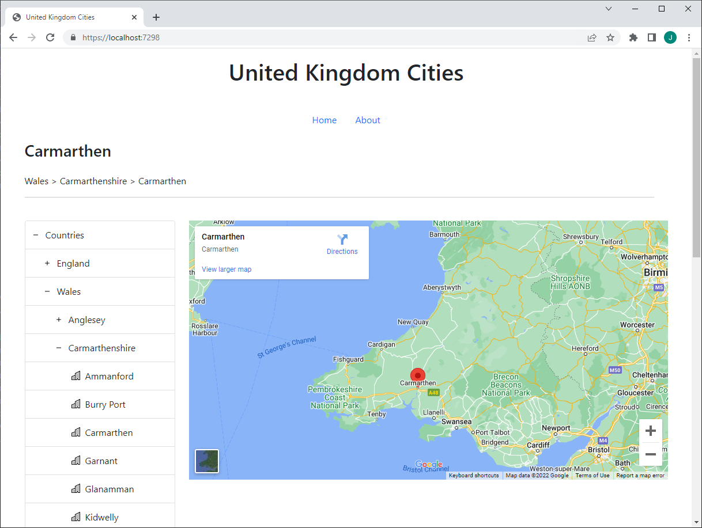

Bootstrap provides some nice, clean components for structuring page content. You can also combine various styles to create new effects. In this article we will see how to combine [List Groups](https://getbootstrap.com/docs/5.2/components/list-group/) with the [Collapse](https://getbootstrap.com/docs/5.2/components/collapse/) plugin to create a tree like representation of some hierarchical data:

- [Bootstrap Collapse](https://getbootstrap.com/docs/5.2/components/collapse/)
- [Bootstrap List Group](https://getbootstrap.com/docs/5.2/components/list-group/)

Once we've mocked up the HTML and CSS for our treeview, we will look to convert the static HTML to a data driven solution in an ASP.NET Core Web App. There is a finished example solution available on [Github](https://github.com/johnmmoss/AspNetCore-Samples/tree/main/AspNetWebBootstrapTree).

### Collapsing Nested List Groups

From the examples pages listed above we can see that to use collapse we specify `data-bs-toggle="collapse"` for an anchor tag, and set the `href` to the `id` of the `div` that we want to toggle open. If we also apply a class of `list-group` to the parent `div`s and `list-group-item` to the child `a` tags then we get the nicely styled List Group controls displayed.

So, the HTML for a one level tree hierarchy using these rules is:

```html
<div class="list-group">
  <a class="list-group-item" data-bs-toggle="collapse" href="#countries">
    Countries
  </a>
  <div id="countries" class="list-group collapse">
    <a class="list-group-item" data-bs-toggle="collapse"> England </a>
    <a class="list-group-item" data-bs-toggle="collapse"> Scotland </a>
    <a class="list-group-item" data-bs-toggle="collapse"> Wales </a>
  </div>
</div>
```

The resulting rendered HTML can be seen below. If you click on the **Countries** link it will expand to show England, Scotland and Wales in a List Group:

<div class="list-group">
  <a class="list-group-item" data-bs-toggle="collapse" href="#demo0-countries">
    Countries
  </a>
  <div id="demo0-countries" class="list-group collapse">
    <a class="list-group-item" data-bs-toggle="collapse">
      England
    </a>
    <a class="list-group-item" data-bs-toggle="collapse">
      Scotland
    </a>
    <a class="list-group-item" data-bs-toggle="collapse">
      Wales
    </a>
  </div>
</div>

<br />

The above example shows the simple pattern that can be used to create a dropdown menu. If we repeat this same idea, nesting `div`s for counties and their cities then the HTML does get a little more complicated:

```html
<div class="list-group">
  <a class="list-group-item" data-bs-toggle="collapse" href="#countries">
    Countries
  </a>
  <div id="countries" class="list-group collapse">
    <a class="list-group-item" data-bs-toggle="collapse" href="#countries-0">
      England
    </a>
    <div id="countries-0" class="list-group collapse">
      <a
        class="list-group-item"
        data-bs-toggle="collapse"
        href="#countries-0-counties-0"
      >
        Yorkshire
      </a>
      <div id="countries-0-counties-0" class="list-group collapse">
        <a class="list-group-item"> Leeds </a>
        <a class="list-group-item"> York </a>
        <a class="list-group-item"> Sheffield </a>
      </div>
      <a class="list-group-item" data-bs-toggle="collapse"> Lancaster </a>
      <a class="list-group-item" data-bs-toggle="collapse"> Lincolnshire </a>
    </div>
    <a class="list-group-item" data-bs-toggle="collapse"> Scotland </a>
    <a class="list-group-item" data-bs-toggle="collapse"> Wales </a>
  </div>
</div>
```

The above HTML can be seen rendered below. Now, if you click on **Countries** > **England** > **Yorkshire** you will see the cities Leeds, York and Sheffield listed as a flat structure:

<div class="list-group">
  <a class="list-group-item" data-bs-toggle="collapse" href="#demo1-countries">
    Countries
  </a>
  <div id="demo1-countries" class="list-group collapse">
    <a
      class="list-group-item"
      data-bs-toggle="collapse"
      href="#demo1-countries-0"
    >
      England
    </a>
    <div id="demo1-countries-0" class="list-group collapse">
      <a
        class="list-group-item"
        data-bs-toggle="collapse"
        href="#demo1-countries-0-counties-0"
      >
        Yorkshire
      </a>
      <div id="demo1-countries-0-counties-0" class="list-group collapse">
        <a class="list-group-item">Leeds</a>
        <a class="list-group-item">York</a>
        <a class="list-group-item">Sheffield</a>
      </div>
      <a class="list-group-item" data-bs-toggle="collapse">
        Lancaster
      </a>
      <a class="list-group-item" data-bs-toggle="collapse">
        Lincolnshire
      </a>
    </div>
    <a class="list-group-item" data-bs-toggle="collapse">
      Scotland
    </a>
    <a class="list-group-item" data-bs-toggle="collapse">
      Wales
    </a>
  </div>
</div>

<br />

So far, so good. We have the functionality and structure of our treeview, but its not looking great. We really need to add some styles so that the nested data is easier to understand.

### Styling the Treeview

Before adding some styles, we first add a new class to the very first div. This provides a hook in to the root `list-group`:

```html
<div class="tree-view list-group">...</div>
```

The stylesheet shown below performs the following actions:

- Reduce all borders between each list item to a single line.
- Add a border around the outside of the control.
- Standardise spacing and padding.
- Slide each nested item in by a fixed amount.

```css
/* Reset all list items to have just a top border */
.tree-view .list-group-item {
  border-radius: 0;
  border-width: 1px 0 0 0;
  padding: 0.75rem 0.8rem;
}

/* Add a border to the top level */
.tree-view {
  width: 50%;
  border: 1px solid rgba(0, 0, 0, 0.125);
  border-radius: 4px;
  overflow: hidden;
}

/* Remove duplicate top border  */
.tree-view > .list-group-item:first-child {
  border-top-width: 0;
}

/* Add padding for nested items */
.tree-view > .list-group-item {
  padding-left: 35px;
}
.tree-view > .list-group > .list-group-item {
  padding-left: 55px;
}
.tree-view > .list-group > .list-group > .list-group-item {
  padding-left: 80px;
}
.tree-view > .list-group > .list-group > .list-group > .list-group-item {
  padding-left: 90px;
}
```

#### Adding Collapse Icons

Before adding styles for the collapse icons, we first need to add some more classes to each link that toggles a collapsible `div`. The styles `collapse-indicator`, `collapse-indicator-pos-n` and `collapsed` work together to show plus sign for collapsed nodes and a minus for extracted:

```html
<a
  class="list-group-item collapse-indicator collapse-indicator-pos-1 collapsed"
  data-bs-toggle="collapse"
  href="#countries-0"
>
  England
</a>
```

The corresponding styles that work with these classes:

```css
.collapse-indicator {
  background-image: url(/images/dash.svg);
  background-repeat: no-repeat;
}

.collapse-indicator.collapsed {
  background-image: url(/images/plus.svg);
}

.collapse-indicator-pos-0 {
  background-position: 10px 50%;
}

.collapse-indicator-pos-1 {
  background-position: 30px 50%;
}

.collapse-indicator-pos-2 {
  background-position: 50px 50%;
}
```

**Notes:**

- The Bootstrap Collapse plugin strips off the `collapsed` CSS style when the link is clicked.
- Each `collapse-indicator-pos-n` indents the icon for each nested list group.
- The `.collapse-indicator.collapsed` CSS selector takes precedence over `.collapse-indicator` replacing the `dash.svg` icon with `plus.svg`.
- The `dash.svg` and `plus.svg` images are available for download from the [bootstrap icons](https://icons.getbootstrap.com/) webpage.

#### Adding a City Icon

Finally, lets add an icon to each city at the bottom of the treeview hierarchy. First we update the HTML for the cities adding an `i` tag with the `city-icon` class:

```html
<a class="list-group-item">
  <i class="city-icon"></i>
  Lincoln
</a>
```

And we add the `city-icon` style to our CSS stylesheet:

```css
.city-icon {
  background: url(/images/building.svg) no-repeat center left;
  padding: 12px;
}
```

Don't forget to copy the `building.svg` image from the [Bootstrap Icons](https://icons.getbootstrap.com/icons/building/) page into the appropriate file location.

#### Sample Styled Treeview

Combining the styles and html together we get the following treeview with static data:

<div class="tree-view list-group">
  <a
    class="list-group-item collapse-indicator collapse-indicator-pos-0 collapsed"
    data-bs-toggle="collapse"
    href="#countries"
  >
    Countries
  </a>
  <div id="countries" class="list-group collapse">
    <a
      class="list-group-item collapse-indicator collapse-indicator-pos-1  collapsed"
      data-bs-toggle="collapse"
      href="#countries-0"
    >
      England
    </a>
    <div id="countries-0" class="list-group collapse">
      <a
        class="list-group-item collapse-indicator collapse-indicator-pos-2 collapsed"
        data-bs-toggle="collapse"
        href="#countries-0-counties-0"
      >
        Yorkshire
      </a>
      <div id="countries-0-counties-0" class="list-group collapse">
        <a class="list-group-item">
          <i class="city-icon"></i>
          Leeds
        </a>
        <a class="list-group-item">
          <i class="city-icon"></i>
          York
        </a>
        <a class="list-group-item">
          <i class="city-icon"></i>
          Sheffield
        </a>
      </div>
      <a
        class="list-group-item collapse-indicator collapse-indicator-pos-2 collapsed"
        data-bs-toggle="collapse"
        href="#countries-0-counties-1"
      >
        Lancashire
      </a>
      <div id="countries-0-counties-1" class="list-group collapse">
        <a class="list-group-item">
          <i class="city-icon"></i>
          Lancaster
        </a>
      </div>
      <a
        class="list-group-item collapse-indicator collapse-indicator-pos-2 collapsed"
        data-bs-toggle="collapse"
        href="#countries-0-counties-2"
      >
        Lincolnshire
      </a>
      <div id="countries-0-counties-2" class="list-group collapse">
        <a class="list-group-item">
          <i class="city-icon"></i>
          Lincoln
        </a>
      </div>
    </div>
    <a
      class="list-group-item collapse-indicator collapse-indicator-pos-1 collapsed"
      data-bs-toggle="collapse"
    >
      Scotland
    </a>
    <a
      class="list-group-item collapse-indicator collapse-indicator-pos-1 collapsed"
      data-bs-toggle="collapse"
    >
      Wales
    </a>
  </div>
</div>
<br />

Once again, try clicking **Countries** > **England** > **Yorkshire** and see the new styles applied. This example has cities for each county in England which shows more a full dataset being displayed.

Nice! We've combined a List Group with the Collapse plugin to create a simple treeview. However, in a real world scenario this control would be data driven with data read server side. So lets develop these mocks by adding them into an ASP.NET Core Web App to create a more realistic solution.

### Dynamic Data Driven Treeview

So far our treeview is looking good, but its not very realistic as we've manually written out the HTML. Now lets look to load our tree view from data in a file.

First up we need some data. Paul Stenning has provided a CSV of [UK Towns and Countries](https://www.paulstenning.com/uk-towns-and-counties-list/). This download is a list of over one-thousand seven hundred cities and counties from England, Scotland, Wales and Northern Ireland.

#### Preparing the Data

Now that we have found a suitable data source we need to convert the data into a model that can be used by the Razor View. After a little bit of head scratching I came up with the following steps:

1. First download the UK Towns and Countries CSV and save it to `Data\Towns.csv`
2. In the `Index.cshtml.cs` `OnGet` method, start by using `System.IO` to read the CSV file.
3. Convert each line of the CSV to a `CityRow` object so that we can use the resulting collection to run a `GroupBy` on.
4. Do a `GroupBy` on the collection of `CityRow` objects generating a collection of `GroupedCityRow` objects grouped by country and county.
5. Finally, convert our `GroupedCityRow` collection into a `CountryTreeViewModel` class which is a hierarchical representation of our countries, counties and cities.

The sample code below covers steps one to four:

```csharp
public class CityRow
{
	public string Country { get; set; }
	public string County { get; set; }
	public string City { get; set; }
}

public class GroupedCityRow
{
	public string Country { get; set; }
	public string County { get; set; }
	public List<string> Cities { get; set; }
}

var parsedCityRows = System.IO.File.ReadAllLines("data\\Towns.csv")
	.Where(x => x.Split(",")[0] != "Town")
	.Select(x =>
	{
		var parsedRow = x.Split(",");
		return new CityRow
		{
			City = parsedRow[0],
			County = parsedRow[1],
			Country = parsedRow[2]
		};
	})
	.ToList();

var groupedCityRows = parsedCityRows
	.GroupBy(
		city => new { city.Country, city.County },
		city => city,
		(key, grouping) =>
		{
			return new GroupedCityRow
			{
				Country = key.Country,
				County = key.County,
				Cities = grouping.Select(x => x.City).ToList()
			};
		})
	.ToList();
```

The resulting `groupedCityRows` is a flat collection for each **county**. The final step, step five, is to convert this flat collection into the desired hierarchy of **countries**, **counties**, **cities**. The final model classes and the sample code to do this conversion is shown below:

```csharp
public class TreeViewModel
{
	public List<CountryTreeViewModel> Countries { get; set; }
}

public class CountryTreeViewModel
{
	public string Name { get; set; }

	public List<CountyTreeViewModel> Counties { get; set; }
}

public class CountyTreeViewModel
{
	public string Name { get; set; }

	public List<string> Cities { get; set; }
}

var englandCounties = FilterToCountyTreeViewModel(groupedCityRows, "England");
var walesCounties = FilterToCountyTreeViewModel(groupedCityRows, "Wales");
var scotlandCounties = FilterToCountyTreeViewModel(groupedCityRows, "Scotland");
var northernIrelandCounties = FilterToCountyTreeViewModel(groupedCityRows, "Northern Ireland");

var treeViewModel = new TreeViewModel
{
	Countries = new List<CountryTreeViewModel>
	{
		new() { Name = "England", Counties = englandCounties },
		new() { Name = "Wales", Counties = walesCounties },
		new() { Name = "Scotland", Counties = scotlandCounties },
		new() { Name = "Northern Ireland", Counties = northernIrelandCounties }
	}
};

TreeModel = treeViewModel;

public List<CountyTreeViewModel> FilterToCountyTreeViewModel(List<GroupedCityRow> groupedCityRows, string countryName)
{
	return groupedCityRows
		.Where(x => x.Country.ToLower() == countryName.ToLower())
		.Select(x => new CountyTreeViewModel { Name = x.County, Cities = x.Cities })
		.ToList();
}
```

There is quite a bit of code to take our CSV data and convert it into hierarchical data that can be used to drive the treeview. The key part is the Linq `GroupBy` which does most of the work. I found this tutorial useful in explaining the Linq `GroupBy`:

- [GroupBy Multiple Keys in Linq](https://dotnettutorials.net/lesson/groupby-multiple-keys-in-linq/)

We can see the previous code snippet sets a property `TreeModel`. This is the model that is presented for the Razor View.

### Writing the Razor View

Now that we have the data being read and processed and presented to the page as a `TreeModel` property, we can write the Razor based on the mockups from above:

```html
<div class="tree-view list-group">
  <a
    class="list-group-item collapse-indicator collapse-indicator-pos-0 collapsed"
    data-bs-toggle="collapse"
    href="#countries"
  >
    Countries
  </a>
  <div id="countries" class="list-group collapse">
    @for (var i = 0; i < Model.TreeModel.Countries.Count(); i++) {
    <a
      class="list-group-item collapse-indicator  collapse-indicator-pos-1  collapsed"
      data-bs-toggle="collapse"
      href="#countries-@i"
    >
      @Model.TreeModel.Countries[i].Name
    </a>
    <div id="countries-@i" class="list-group collapse">
      @for (var j = 0; j < Model.TreeModel.Countries[i].Counties.Count(); j++) {
      <a
        class="list-group-item collapse-indicator collapse-indicator-pos-2 collapsed"
        data-bs-toggle="collapse"
        href="#countries-@i-counties-@j"
      >
        @Model.TreeModel.Countries[i].Counties[j].Name
      </a>
      <div id="countries-@i-counties-@j" class="list-group collapse">
        @foreach (var city in Model.TreeModel.Countries[i].Counties[j].Cities) {
        <a class="list-group-item">
          <i class="city-icon"></i>
          @city
        </a>
        }
      </div>
      }
    </div>
    }
  </div>
</div>
```

The Razor View ends up being a lot simpler than the original sample HTML. We use the `i` and `j` variables to create dynamic `id` values as we loop through each Country and County.

If you run this code in an **ASP.NET Web App** site you can see same treeviews that we created above, but this time with the data from [Paul Stennings](https://www.paulstenning.com/uk-towns-and-counties-list/) site rendered:



### Putting the Treeview to Work

We've built our data driven treeview now lets add some JavaScript to make it actually drive some functionality. First lets store some data with the city anchor tags in data `data-treeview-name` and `data-treeview-location` attributes. Our script can pull these values out and use them when a city is clicked:

```html
<a
  class="list-group-item city"
  data-treeview-name="@city"
  data-treeview-location="@Model.TreeModel.Countries[i].Name > @Model.TreeModel.Countries[i].Counties[j].Name > @city"
>
  <i class="city-icon"></i>
  @city
</a>
```

Now for some pretend functionality 🙂 lets include the [Google Embedded Maps API](https://developers.google.com/maps/documentation/embed/get-started?hl=en_US) `iframe` as per the documentation:

```html
<iframe
  width="600"
  height="450"
  style="border:0"
  loading="lazy"
  allowfullscreen
  referrerpolicy="no-referrer-when-downgrade"
  src="https://www.google.com/maps/embed/v1/place?key=API_KEY
    &q=Space+Needle,Seattle+WA"
>
</iframe>
```

**Note** you will need to create a [Google Api Key](https://developers.google.com/maps/documentation/embed/get-api-key) and replace the `API_KEY` in the above HTML.

Now for some client side scripting. This is a simple JQuery click handler which pulls out the data from the city anchor tag and uses it to update the `src` of the Google Maps `iframe`.

```javascript
$(document).ready(function () {
  $("#countries").collapse("show");
  $(".city").click(function () {
    var city = $(this).attr("data-treeview-name");
    var location = $(this).attr("data-treeview-location");
    $("#map").attr(
      "src",
      `https://www.google.com/maps/embed/v1/place?key=API_KEY&zoom=8&q=${city}`,
    );
    $("#title").text(city);
    $("#location").text(location);
  });
});
```

**Notes**

- So every time we select a city we see that cities location displayed in the Google Maps tile.
- We also set the title and location values as headers on the page.
- The call to `collapse("show")` on our top level `list-group` tag expands the first level of the treeview so that when the page loads the we can see the list of countries displayed.

### Demo Application

There is a final solution available on [Github](https://github.com/johnmmoss/AspNetCore-Samples/tree/main/AspNetWebBootstrapTree) which puts all these samples together. The bulk of the code is in the following three files:

- [Index.cshtml](https://github.com/johnmmoss/AspNetCore-Samples/blob/main/AspNetWebBootstrapTree/AspNetWebBootstrapTree/Pages/Index.cshtml)
- [Index.cshtml.cs](https://github.com/johnmmoss/AspNetCore-Samples/blob/main/AspNetWebBootstrapTree/AspNetWebBootstrapTree/Pages/Index.cshtml.cs)
- [site.css](https://github.com/johnmmoss/AspNetCore-Samples/blob/main/AspNetWebBootstrapTree/AspNetWebBootstrapTree/wwwroot/styles/site.css)

A screenshot of the up and running application is shown below:



**Note** to get the code running you will need to create an [API key for the Google Embedded Api](https://developers.google.com/maps/documentation/embed/get-api-key) and update the `EmbeddedMapsApiKey` setting in the `appsettings.json` accordingly.

### Conclusion

In this article we saw how to combine [Bootstrap List Groups](https://getbootstrap.com/docs/5.2/components/list-group/) with the [Bootstrap Collapse plugin](https://getbootstrap.com/docs/5.2/components/collapse/) to create treeview which can be used for hierarchal data.

We used some custom styles and [Bootstrap Icons](https://icons.getbootstrap.com/) to make it look a little less hideous and then implemented what we learnt in an ASP.NET Core Web App converting the HTML to Razor and using a realistic dataset to render the treeview.

Finally we added some JavaScript and a Google Maps `iframe` so that when a city is clicked its location is set in the Google Maps tile.
