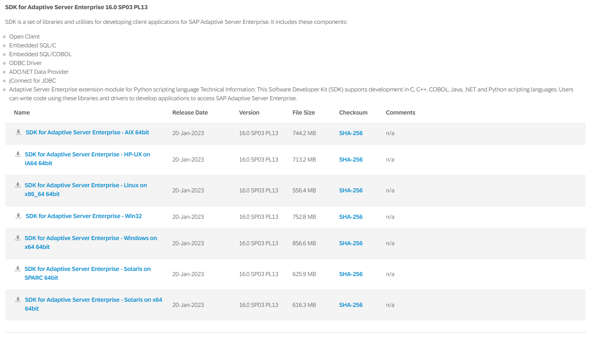
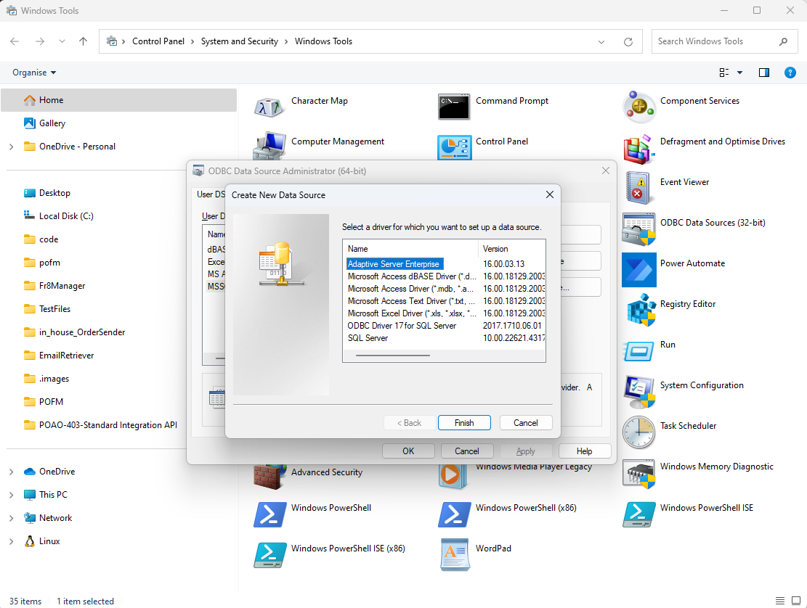
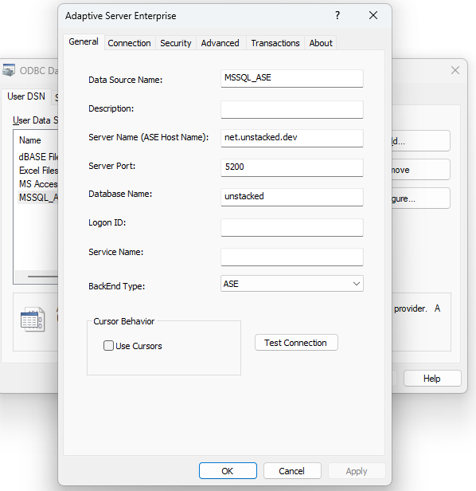

It’s possible to use .NET Core and C# to connect to SAP’s Sybase ASE database using the [AdoNetCore.AseClient](https://github.com/DataAction/AdoNetCore.AseClient) library. It provides…

> a .NET Core native implementation of the TDS 5.0 protocol via an ADO.NET DB Provider

However its not actually an official SAP driver and it is possible to connect to Sybase ASE using the ODBC driver distributed with the official SDK.

Start by going to the [SAP Trials Downloads](https://developers.sap.com/trials-downloads.html) web page and downloading the [Adaptive Server Enterprise](https://www.sap.com/cmp/td/developer-trials-and-downloads.html?id=0055000000000052023&external-site=aHR0cHM6Ly9kZXZlbG9wZXJzLnNhcC5jb20vdHJpYWxzLWRvd25sb2Fkcy5odG1s&trial=%2F%2Fwww.sap.com%2Fregistration%2Ftrial.f47300f6-63b8-4f22-b189-dbadd3c903d6.html) SDK for you server version.

**Note** you will need to register an account and login to download the SDKs!

At the time of writing the web page for the version I required looks like below and I downloaded the Windows on x64 64bit platform:



Unzip and run the `setup.exe` and a number of drivers will be installed including:

- ODBC driver
- jConnect JDBC driver
- ADO.NET Data Provider

ODBC requires creating a data source and in Windows 11 we do this by opening Windows Tools and selecting ODBC Data Sources (64-bit) and then clicking the "Add" button to Create a New Data Source:



When we click finish, the screen to add in the details for the DSN pops up, so enter your details for the Sybase ASE Server that you are trying to access:



**Note** use the "Test Connection" button is helpful to ensure that the details entered are correct.

Once the SDK is installed and the ODBC DSN is setup we are ready to write some code. Create a dotnet core console app to test the connection and install the Odbc package:

```powershell
dotnet add package System.Data.Odbc
```

And now add ADO.NET code to connect to the DSN using the `OdbcConnection`:

```csharp
var connectionString = "Dsn=MSSQL_ASE;uid=user1;pwd=password1";
try
{
    using (OdbcConnection connection = new OdbcConnection(connectionString))
    {
        connection.Open();
        var cmd = new OdbcCommand("select top 5 * from students", connection);
        using (var reader = cmd.ExecuteReader())
        {
            while (reader.Read())
            {
                for (var i = 0; i < reader.FieldCount; i++)
                {
                    Console.WriteLine(reader[i]);
                }
            }
        }
    }
}
catch (Exception ex)
{
    Console.WriteLine(ex.Message);
}
```

And now you should see the student data streaming down the console window 🎉

## **References**

- [SAP Trials Downloads](https://developers.sap.com/trials-downloads.html)
- [How can I connect with Sybase 17 ASA in .NET Core, using ODBC?](https://stackoverflow.com/a/58130702)
- [How to connect to Sybase database from .net core](https://stackoverflow.com/a/48511019)
