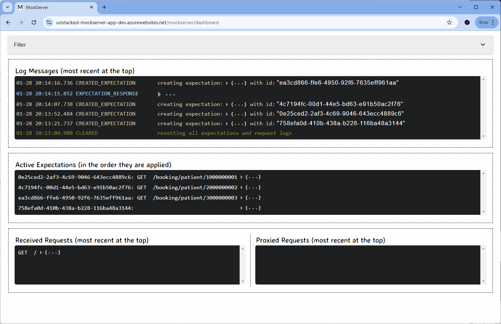
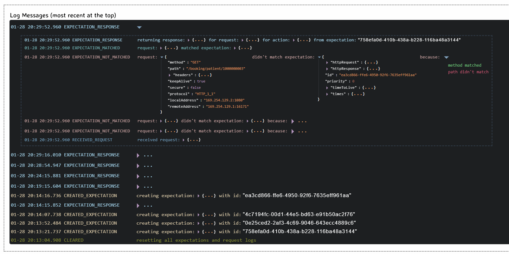

Deploying applications using Terraform and Docker makes it extremely quick and easy to setup software in Azure. In this tutorial I use the [MockServer docker image](https://hub.docker.com/r/mockserver/mockserver) to deploy an application that can be used to mock REST API calls during development phases. Checkout the [MockServer docs](https://mock-server.com/) for more information.

## Prerequisites

To run terraform we need to download the terraform executable from the [Hashicorp website](https://developer.hashicorp.com/terraform/install). Extract the zip to a known location and add that location to your PATH variable so that you can execute in a command line terminal.

Also, ensure you have the [Azure CLI](https://learn.microsoft.com/en-us/cli/azure/install-azure-cli-windows?tabs=azure-cli) tools installed. We will use the `az login` command from the terminal which will redirect to a browser for you to login as well as to setup the initial Azure resources.

## Storing the Terraform State

We will store the state remotely in an Azure Storage Blob which makes it easier to manage the resources for continuous delivery scenarios. First we use the `az` command mentioned above to create a resource group, storage account and blob container:

```powershell
az login

$RESOURCE_GROUP_NAME='unstacked-mockserver-rg-dev'
$STORAGE_ACCOUNT_NAME="tfstatestorage$(Get-Random)"
$CONTAINER_NAME='tfstate'
#
# Create resource group
#
az group create --name $RESOURCE_GROUP_NAME --location ukwest
#
# Create storage account
#
az storage account create --resource-group $RESOURCE_GROUP_NAME --name $STORAGE_ACCOUNT_NAME --location uksouth --sku Standard_LRS
#
# Create blob container
#
az storage container create --name $CONTAINER_NAME --account-name $STORAGE_ACCOUNT_NAME --verbose
```

The state will be stored in a file called `terraform.tfstate` inside the container `tfstatestorageXXX` in the specified resource group.

As of [version 4 of the azurerm terraform provider](https://registry.terraform.io/providers/hashicorp/azurerm/latest/docs/guides/4.0-upgrade-guide#specifying-subscription-id-is-now-mandatory) we are now required to provide the Azure Subscription ID. Use the `az show` command to find the Subscription ID and export it as an environment variable:

```powershell
# Read Subscription ID
az account show

# Export the id as an evnironment variable
$env:ARM_SUBSCRIPTION_ID = "<azure-subscription-id>"
```

## Creating the Infrastructure

The full Terraform code for deploying the MockServer is shown below. Save the content to a file locally called `main.tf` :

```powershell
terraform {
  required_providers {
    azurerm = {
      source  = "hashicorp/azurerm"
      version = "~> 4.16.0"
    }
  }
  backend "azurerm" {
    resource_group_name  = "unstacked-mockserver-rg-dev"
    storage_account_name = "tfstatestorage1718258922"
    container_name       = "tfstate"
    key                  = "terraform.tfstate"
  }
}

provider "azurerm" {
  features {}
}

data "azurerm_resource_group" "rg" {
  name = "unstacked-mockserver-rg-dev"
}

resource "azurerm_service_plan" "mockapi_plan" {
  name                = "unstacked-mockserver-asp-dev"
  resource_group_name = data.azurerm_resource_group.rg.name
  location            = data.azurerm_resource_group.rg.location
  os_type             = "Linux"
  sku_name            = "B1"
}

resource "azurerm_linux_web_app" "mockapi_app" {
  name                = "unstacked-mockserver-app-dev"
  resource_group_name = data.azurerm_resource_group.rg.name
  location            = data.azurerm_resource_group.rg.location
  service_plan_id     = azurerm_service_plan.mockapi_plan.id
  https_only          = true

  site_config {
    minimum_tls_version = "1.2"
    application_stack {
      docker_registry_url = "https://index.docker.io"
      docker_image_name   = "mockserver/mockserver:latest"
    }
  }

  app_settings = {
    "WEBSITES_PORT" = "1080"
  }

  identity {
    type = "SystemAssigned"
  }
}
```

In the code above the [backend section](https://developer.hashicorp.com/terraform/language/backend/azurerm) sets up the configuration for the remote Terraform state ensuring that the state file is stored in Azure and not locally. Also, we actually store the MockServer resources in the same resource group that we created for the Terraform file by using a [Terraform Data Source](https://developer.hashicorp.com/terraform/language/data-sources).

With the above code saved to file we now ready to use the Terraform CLI executable downloaded in the first step to create the MockServer resources. Open a command line terminal and `CD` to where you saved `main.tf`. The basic Terraform commands are:

| **Command** | **Description**                                                                              |
| ----------- | -------------------------------------------------------------------------------------------- |
| `init`      | Initialise the terraform provider                                                            |
| `plan`      | Generate a plan of the infrastructure showing what is about to be added, changed or deleted. |
| `apply`     | Apply the resources described by the terraform code                                          |
| `destroy`   | Destroy the resources created                                                                |

**Note** you can use `set-alias` in PowerShell to create a shorter form of the terraform command - less typing!

Run the following commands to create the MockServer in an Azure Web App resource in your subscription:

```powershell
set-alias ter terraform

ter init
ter plan
ter apply -auto-approve
```

The commands take sometime to run through, but at the end of the `apply` operation the new resources will be created in the Azure Portal.

## Using MockServer

If you browse to the `mockserver/dashboard` path of your deployed MockServer you can see the dashboard outlining the status of any expectations created and requests made:



Its possible to create a variety of expectations and responses, MockServer is very configurable and has some great documentation:

- [Clients](https://www.mock-server.com/mock_server/mockserver_clients.html)
- [Request Property Matchers](https://www.mock-server.com/mock_server/getting_started.html#request_property_matchers)
- [Response Actions](https://www.mock-server.com/mock_server/creating_expectations.html#response_action)

I particularly like the detailed logging which explains why an incoming request does not match a particular expectation - extremely useful for debugging:


