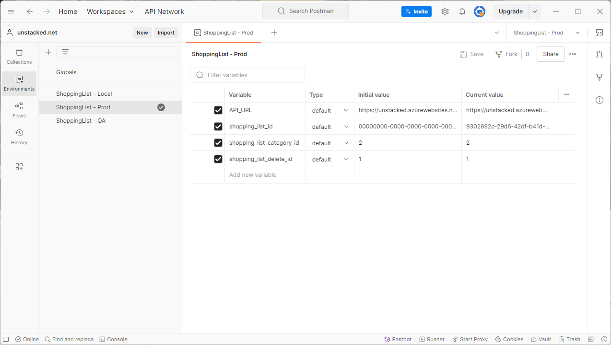
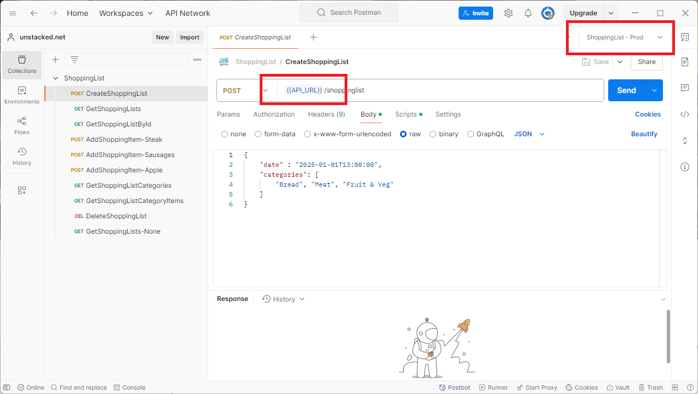
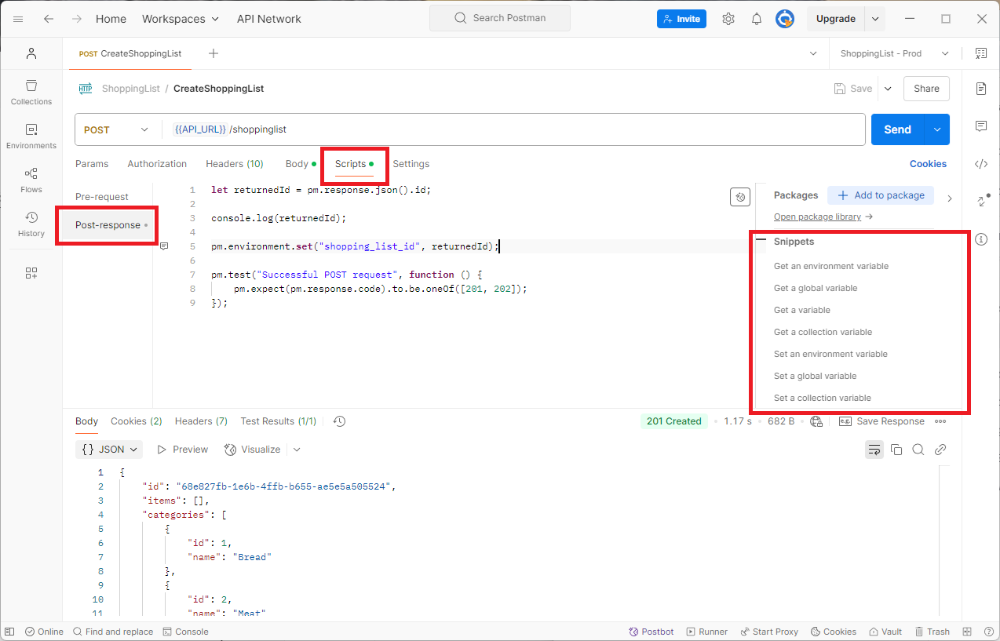
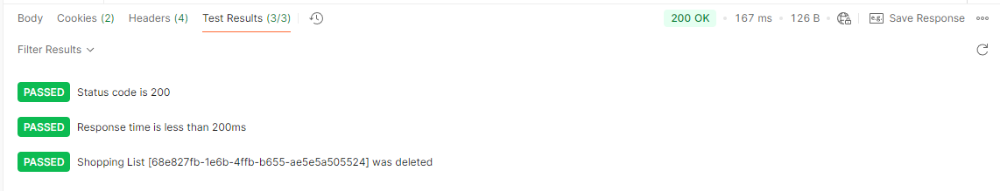
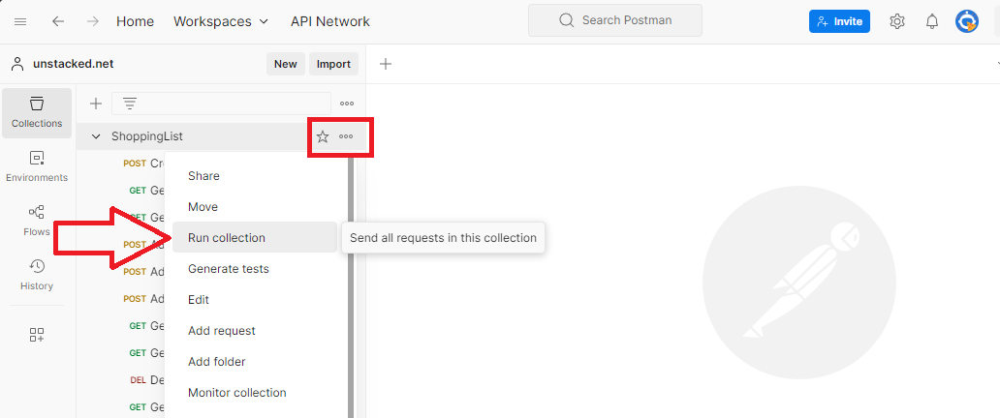
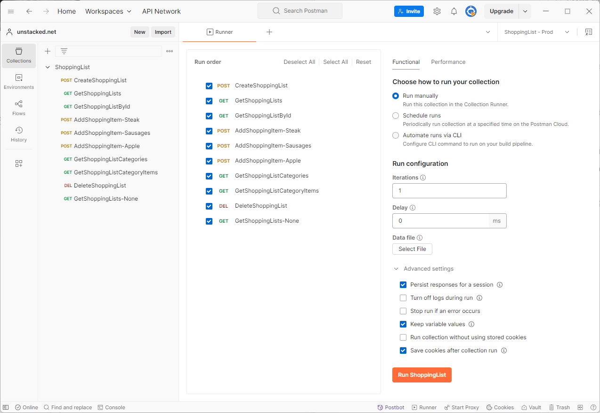
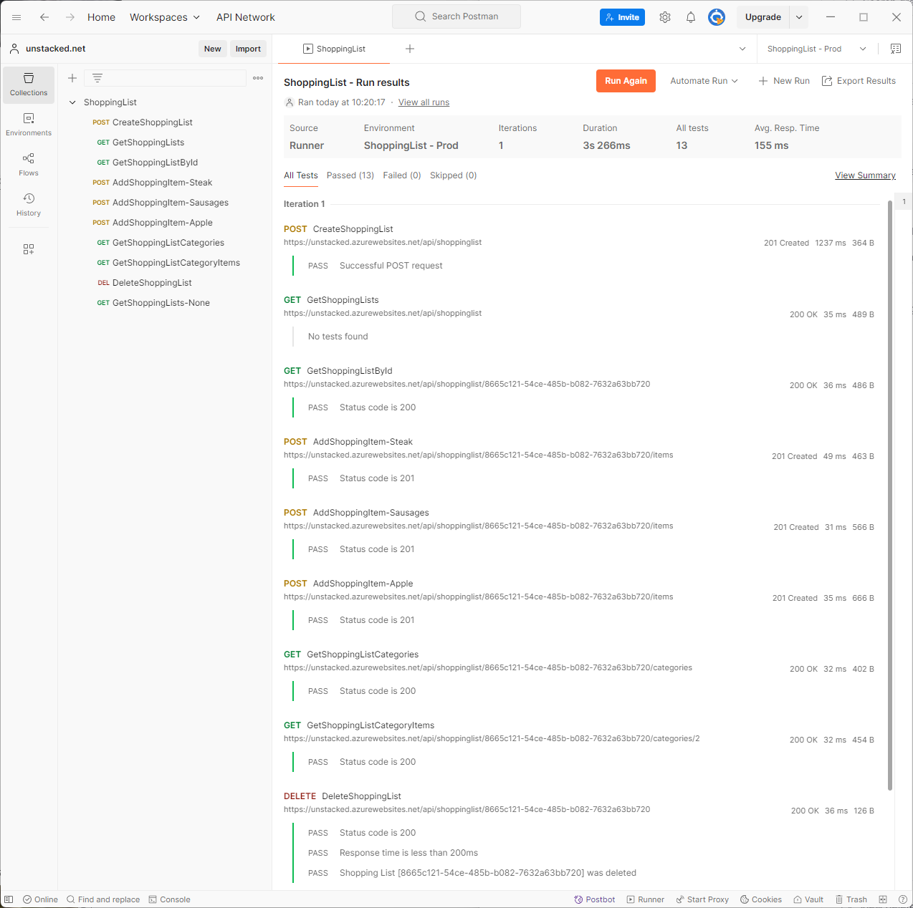

The [Postman API client](https://www.postman.com/product/tools/) is easy enough to get started with creating collections and managing basic API calls. However there is a lot of functionality built into the app which can take a while to discover. Here are 3 features that I find particularly useful.

## 1\. Using Variables To Manage Environments

When developing applications for clients we typically deploy through multiple environments like QA, Test and Production. Postman provides the ability to manage variables for different environments so we don’t need to create a collection for each environment that our API is deployed to, in affect parameterising our collection.

Below we can see the sidebar menu “Environments” on the far left of the screenshot is selected. I have added three environments for a sample Shopping List API: `ShoppingList - Local`, `ShoppoingList - QA` and `ShoppingList - Prod`. The Prod environment is selected and main window shows the Prod environments’ values:



When sending a request we select the environment using the dropdown in the top right of Postman as shown in the screenshot below. By changing the environment dropdown we can change the `API_URL` value and target the different environments for our deployed code:



This way we don’t need to create a collection for each deployed environment. We can have one collection of requests and use Postman’s Environments feature to essentially parameterise the requests for each deployed environment.

See [the postman documentation](https://learning.postman.com/docs/sending-requests/variables/variables/) for more information about storing and using variables.

## 2\. Using JavaScript To Set Variables and Add Assertions

Postman also provides the functionality to [write JavaScript code](https://learning.postman.com/docs/tests-and-scripts/write-scripts/postman-sandbox-api-reference/) before and after a request is sent. For example when a response is returned after an object is created, we can store the ID in a variable:

```javascript
let returnedId = pm.response.json().id;

console.log(returnedId);

pm.environment.set("shopping_list_id", returnedId);
```

In the above snippet we are reading the ID property from the returned response using the built-in `pm.response` object and setting the environment variable `shopping_list_id`. This script is entered into the Post-response tab of the Scripts menu:



When the above request was made the id value `68e827fb-1e6b-4ffb-b655-ae5e5a505524` was set in the `shopping_list_id` variable. This variable can then be referenced in subsequent requests to, for example add items to the shopping list.

Also note that there is a library of possible scripts on the right hand side outlined in red. By clicking one of these links, the associated snippet will be outputted to the window.

The Post-response tab can actually do test assertions and even make further API calls. The script below is for the `DeleteShoppingList` request:

```javascript
pm.test("Status code is 200", function () {
  pm.response.to.have.status(200);
});

let apiUrl = pm.environment.get("API_URL");
let shoppingListId = pm.environment.get("shopping_list_id");
let endpoint = `${apiUrl}/shoppinglist${shoppingListId}`;

console.log(endpoint);
console.log(shoppingListId);

pm.sendRequest(endpoint, function (err, res) {
  pm.test(`Shopping List [${shoppingListId}] was deleted`, function () {
    pm.expect(res.code).to.equal(404);
  });
});

pm.test("Response time is less than 200ms", function () {
  pm.expect(pm.response.responseTime).to.be.below(200);
});
```

In the code above we are reading some of the environment variables and making a request back to the API to confirm that the item was not found - a bit of a contrived example, but it does show the possibilities. When this request is run the results of the test assertions are displayed in the test results window:



## 3\. Automated Testing Using Run Collection

We established in the previous step that we can use JavaScript to write assertions for a request, turning postman requests into tests. The next useful feature is the ability to run all the requests for a collection in one go.

Click the three dots next to the Collection name and select “Run collection”:



This will open the runner tab:



Click the nice big orange button “Run ShoppingList” and the tests will run and the results be displayed:



Once you’ve got this far setting up a collection it’s quite easy to [schedule collection runs using Postman’s cloud](https://learning.postman.com/docs/collections/running-collections/scheduling-collection-runs/) or [using the Newman CLI tool](https://learning.postman.com/docs/collections/using-newman-cli/command-line-integration-with-newman/) to incorporate into your own pipeline. Getting rapid feedback in this way can really speed up development and provide assurance that the whole API is working correctly as development proceeds.

The Postman API client is an impressive application which makes working with HTTP endpoints so much easier. I particularly find these 3 features of Postman very useful and use them regularly whenever I have to work with an API.
