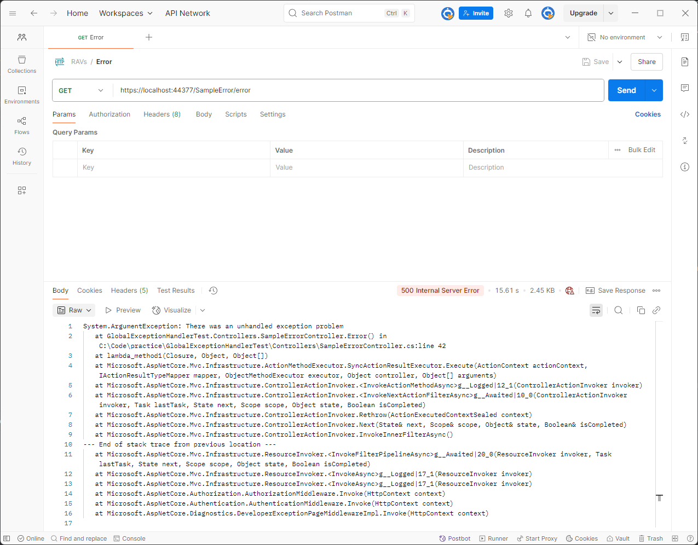
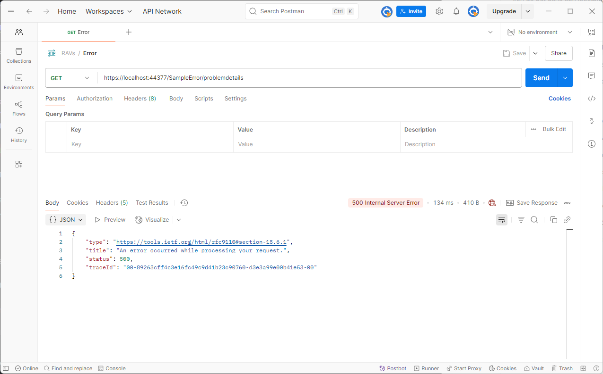

Typically in a ASP.NET Core Web application our code may throw an unhandled exception for many unknown reasons. Consequently its advisable to wrap application code in a global exception handler using a filter or some custom middleware. ASP.NET Core 8 introduces a new interface called [`IExceptionHandler`](https://learn.microsoft.com/en-us/aspnet/core/fundamentals/error-handling?view=aspnetcore-8.0#iexceptionhandler) which can be used to handle exceptions in a central location.

## Current Exception Handling in ASP.NET Core

Before looking at this new feature, let’s first review the default behaviour of a basic controller-based Web API to better understand what this new feature is giving us. The default ASP.NET Core Web API template can be reduced down to the code shown below:

```csharp
var builder = WebApplication.CreateBuilder(args);
builder.Services.AddControllers();

var app = builder.Build();
app.UseHttpsRedirection();
app.UseAuthorization();
app.MapControllers();
app.Run();
```

Next if we add a controller action which throws an exception as shown below then we can mimic an unhandled exception in our application:

```csharp
[HttpGet]
public IActionResult Error()
{
   throw new ArgumentException("There was an unhandled exception problem");
}
```

If we hit this endpoint then we get a 500 internal status code with the stack trace returned as the body of the response:



So by default if we don’t add some sort of error handling we end up with a hideous stack trace returned to the calling application. This often leads to developers wrapping a try/catch statement around application code in a controller action and returning a 500 `StatusCodeResult`. But what response does a `StatusCodeResult` actually result in for the calling application? Let’s add another endpoint to investigate:

```csharp
[HttpGet]
public IActionResult ProblemDetails()
{
	return StatusCode(StatusCodes.Status500InternalServerError);
}
```

And if we hit that endpoint in postman:



So the `StatusCodeResult` seems to have a much nicer response. What’s going on? Enter the problem details abstraction…

## Understanding Problem Details

The `StatusCodeResult` is actually using an internet standard which defines the JSON structure of errors returned in an API. The JSON structure is defined in IETF [RFC 7807](https://datatracker.ietf.org/doc/html/rfc7807) and is known as a problem detail. The definition of a problem detail is:

> a way to carry machine-readable details of errors in a HTTP response to avoid the need to define new error response formats for HTTP APIs.

So by default ASP.NET Core encapsulates error status codes as [problem details](https://learn.microsoft.com/en-us/aspnet/core/fundamentals/error-handling?view=aspnetcore-8.0#problem-details) and can be further configured using the [problem details service](https://learn.microsoft.com/en-us/aspnet/core/web-api/handle-errors?view=aspnetcore-9.0#problem-details-service). Next we will will look at the `IExceptionHandler` as a global error handling solution which uses the [`IProblemDetailsService`](https://learn.microsoft.com/en-us/dotnet/api/microsoft.aspnetcore.http.iproblemdetailsservice?view=aspnetcore-8.0).

## Implementing Global Error Handling with `IExceptionHandler`

In order to implement the `IExceptionHandler` we need to make a couple of changes to the default template that we saw above:

1. Write a `GlobalExceptionHandler` which implements `IExceptionHandler` and handles any exceptions.
2. Register the `GlobalExceptionHandler` in the app start up code.
3. Add in the supporting exception handling middleware.

### 1\. Write A `GlobalExceptionHandler`

In our exception handler we want to log the error and then build and write out a `ProblemDetails` as outlined in the previous section. We return true from the `TryHandleAsync` method to stop the processing of the pipeline:

```csharp
internal sealed class GlobalExceptionHandler : IExceptionHandler
{
    private readonly ILogger<GlobalExceptionHandler> _logger;

    public GlobalExceptionHandler(ILogger<GlobalExceptionHandler> logger)
    {
        _logger = logger;
    }

    public async ValueTask<bool> TryHandleAsync(
        HttpContext httpContext,
        Exception exception,
        CancellationToken cancellationToken)
    {
        _logger.LogError(exception, "An unhandled exception occurred.");

        var problemDetails = new ProblemDetails
        {
            Title = "An error occurred while processing your request.",
            Status = StatusCodes.Status500InternalServerError,
            Type = "https://tools.ietf.org/html/rfc9110#section-15.6.1"
        };

        httpContext.Response.StatusCode = problemDetails.Status.Value;

        await httpContext.Response .WriteAsJsonAsync(problemDetails, cancellationToken);

        return true;
    }
}
```

### 2\. Register the `GlobalExceptionHandler`

To register the exception handler with dependency injection we call the `AddExceptionHandler` method:

```csharp
builder.Services.AddExceptionHandler<GlobalExceptionHandler>();
```

### 3\. Add Supporting Middleware

The `IExceptionHandler` requires the use of the exception handling middleware as well as the registering of the problem details service:

```csharp
// ...
builder.Services.AddProblemDetails();
// ...
app.UseExceptionHandler();
```

### Final Startup Configuration

The final version of the startup code with the above changes now looks like:

```csharp

var builder = WebApplication.CreateBuilder(args);
builder.Services.AddControllers();
builder.Services.AddExceptionHandler<GlobalExceptionHandler>();
builder.Services.AddProblemDetails();

var app = builder.Build();
app.UseExceptionHandler();
app.UseHttpsRedirection();
app.UseAuthorization();
app.MapControllers();
app.Run();
```

## Addressing the Double Logging Issue

The code implemented above will catch all unhandled exceptions but the exception will get logged twice because the exception handling middleware logs as well as the log that we write out in our global exception handling code:

```plaintext
fail: Microsoft.AspNetCore.Diagnostics.ExceptionHandlerMiddleware[1]
      An unhandled exception has occurred while executing the request.
      System.ArgumentException: There was an unhandled exception problem
         at GlobalExceptionHandlerTest.Controllers.SampleErrorController.Error() in C:\Code\practice\GlobalExceptionHandlerTest\Controllers\SampleErrorController.cs:line 42
         at lambda_method1(Closure, Object, Object[])
         at Microsoft.AspNetCore.Mvc.Infrastructure.ActionMethodExecutor.SyncActionResultExecutor.Execute(ActionContext actionContext, IActionResultTypeMapper mapper, ObjectMethodExecutor executor, Object controller, Object[] arguments)
fail: GlobalExceptionHandlerTest.Handlers.GlobalExceptionHandler[0]
      An unhandled exception occurred.
      System.ArgumentException: There was an unhandled exception problem
         at GlobalExceptionHandlerTest.Controllers.SampleErrorController.Error() in C:\Code\practice\GlobalExceptionHandlerTest\Controllers\SampleErrorController.cs:line 42
         at lambda_method1(Closure, Object, Object[])
         at Microsoft.AspNetCore.Mvc.Infrastructure.ActionMethodExecutor.SyncActionResultExecutor.Execute(ActionContext actionContext, IActionResultTypeMapper mapper, ObjectMethodExecutor executor, Object controller, Object[] arguments)
```

There is a github issue open to look at this:

- [Unhandled exceptions are being logged before custom IExceptionHandler is being called](https://github.com/dotnet/aspnetcore/issues/54554)

One solution to solve this is to turn off logging for the middleware by setting it to only output for `Critical` level logs (for Serilog `Fatal`):

```json
{
  "Logging": {
    "LogLevel": {
      "Default": "Trace",
      "Microsoft.AspNetCore": "Trace",
      "Microsoft.AspNetCore.Diagnostics.ExceptionHandlerMiddleware": "Critical"
    }
  },
  "AllowedHosts": "*"
}
```

## Conclusion

In this article we have seen how global error handling in [ASP.NET](http://ASP.NET) Core 8 can be added by implementing the new `IExceptionHandler` interface. We started by looking at the default behaviour of an ASP.NET Core controller-based API and saw that problem details are used by default. We then looked at an implementation of a `GlobalExceptionHandler` which can be used in Web API projects moving forward instead of middleware or filters. We also highlighted a known issue with the `IExceptionHandler` with the double logging bug but, and we saw a way to get round it before the fix is released in .NET 10.

For more information about error handling in ASP.NET be sure to check out MSDN [Handle errors in ASP.NET Core](https://learn.microsoft.com/en-us/aspnet/core/fundamentals/error-handling?view=aspnetcore-8.0) in particular the [IExceptionHandler](https://learn.microsoft.com/en-us/aspnet/core/fundamentals/error-handling?view=aspnetcore-8.0#iexceptionhandler) section.
