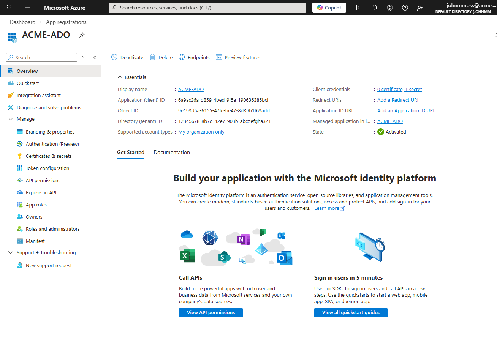
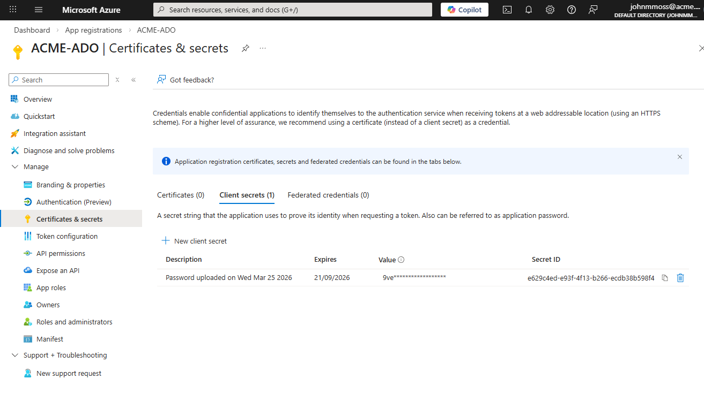
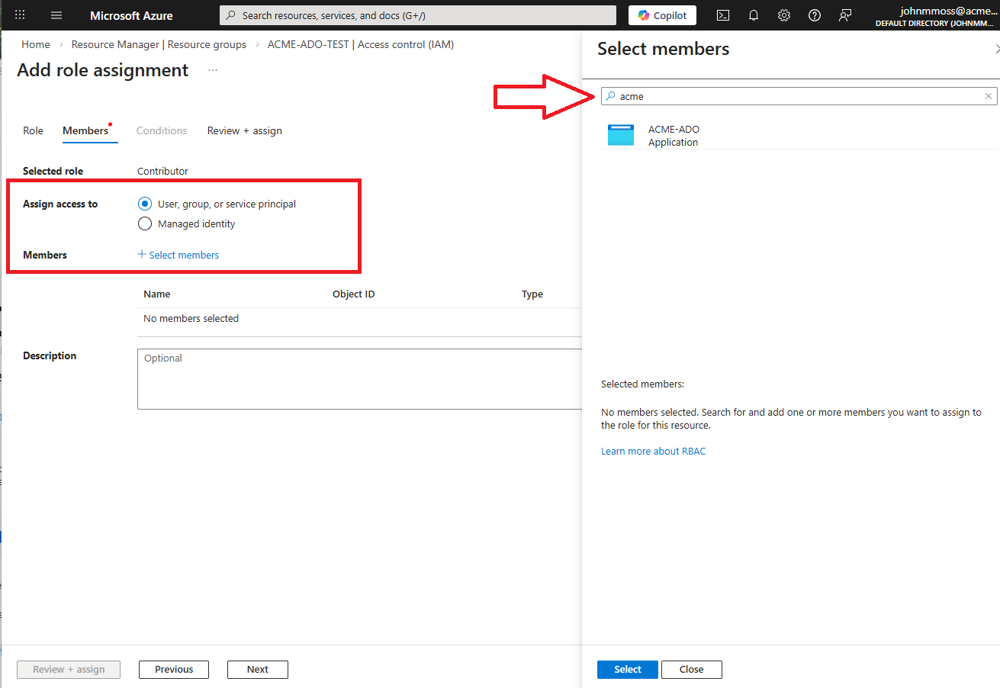
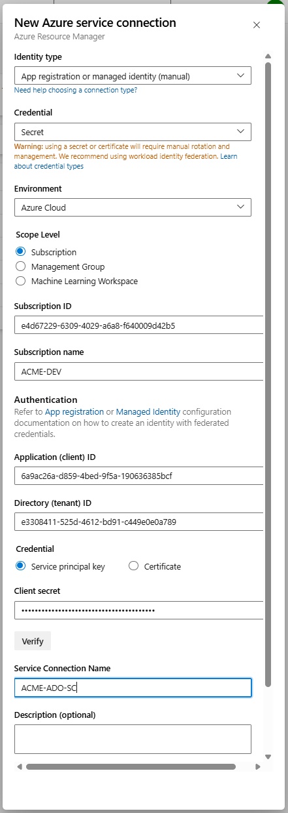
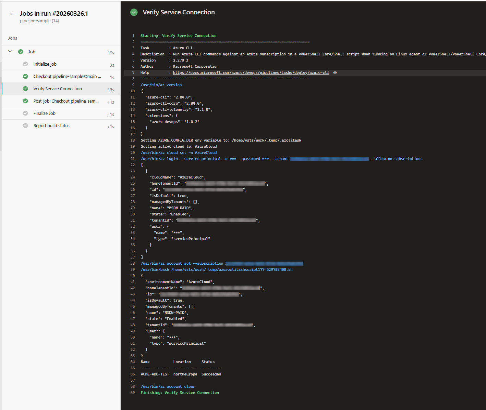

Azure Devops uses a Service Connection to connect through to the Azure cloud. The recommended approach is to use automated [workload identity federation](https://learn.microsoft.com/en-gb/azure/devops/pipelines/library/connect-to-azure?view=azure-devops#create-an-app-registration-with-workload-identity-federation-automatic) but this is not always possible due to organisational constraints or access permission issues. Although undesirable, it is possible to manually create a Service Principal and associated secret which can then be used to setup a Service Connection but it is considered less secure as you have to manage the secret, including generating a new one every three months.

In this tutorial I will walk through setting up an App Registration which can then be used to create a service connection in Azure DevOps through to Azure. It describes how to assign the required permissions and how to fill out the Add new connection form before finally giving an overview of how to test the connection using a pipeline.

### 1. Adding an Azure Service Principal

In order to be able to authenticate and access Azure resources we create an App Registration and client secret which creates a corresponding Service Principal. Navigate to the [App Registrations](https://portal.azure.com/#view/Microsoft_AAD_RegisteredApps/ApplicationsListBlade) in the Azure portal and click "New Registration". Add a name and click Register. You will be redirected to the App Registration's overview page:



Click the Certificates & secrets menu in the Manage section and add a secret, keeping a note of the secret for future use:



**Note** this secret will expire so this password needs to be regenerated periodically.

### 2. Add Permissions to the resource group in Azure

When deploying to the Azure cloud the Service Principal needs permission's to create and edit resources. To add a permission, navigate to the Access Control IAM menu of the resource group that you are deploying to and click to Add a role assignment. Select the Privileged administrator roles tab and select the ***Contributor*** permission. Use the Select members form to add the principal just created:



**Note** to be able to add permissions to resources you will also need to add the ***User Access Administrator*** permission.

### 3. Create Azure Devops Service Connection

With the App Registration created and permissions assigned, we now have a Service Principal that can be used to create our Service Connection in Azure Devops. The Add new Service Connection form takes quite a few details, here is a summary:

| Name                    | Example                              | Notes                                                        |
| ----------------------- | ------------------------------------ | ------------------------------------------------------------ |
| Subscription ID         | e4d67229-6309-4029-a6a8-f640009d42b5 | Read from `az account list`                                  |
| Subscription Name       | ACME-DEV                             | Read from `az account list`                                  |
| Application (client) ID | 6a9ac26a-d859-4bed-9f5a-190636385bcf | The `Application (client) ID` value from app registration page (see above) |
| Client secret           | your-client-secret-here              | The secret Value created in the App Registration (see above) |
| Directory (tenant) ID   | e3308411-525d-4612-bd91-c449e0e0a789 | Read from `az account list`                                  |
| Service connection name | ACME-ADO-SC                          |                                                              |

**Note** you can get the subscription and tenant information by running `az account list -o table`

To create the new service connection, navigate to the Service Connections menu in the Project Settings area of the Azure Devops portal. Click New service connection and select the Azure Resource Manager option. The form is to be completed like so:



Scroll down and click save and you should see the newly created service connection in the list. Now we are all setup, lets run a test to see if a pipeline can see Azure.

### 4. Testing the Service Connection

Now that we have the Service Connection setup, an easy way to test that it's working is just to try to run  a simple Azure CLI command in yaml. Create a git repository and add an azure-pipelines yaml file with the following yaml:

```yaml
trigger: none

pool:
  vmImage: ubuntu-latest

steps:
  - task: AzureCLI@2
    displayName: 'Verify Service Connection'
    inputs:
      azureSubscription: 'ACME-ADO-SC'
      scriptType: bash
      scriptLocation: inlineScript
      inlineScript: |
        az account show
        az group list --output table
```

If you now create and run a pipeline with this yaml, you will see the account information printed in the output of the task window:




### Summary

Although not desirable, it is possible to manually add a Service Principal and secret in Azure that can then be used to add a Service Connection to Azure DevOps. Sometimes organisational constraints dictate this approach and I've had to use it on more than one project. The requirement to manage the secret actually makes the solution less secure than the preferred [workload identity federation](https://learn.microsoft.com/en-gb/azure/devops/pipelines/library/connect-to-azure?view=azure-devops#create-an-app-registration-with-workload-identity-federation-automatic) solution. However, it is useful to know that it can be done if required.
