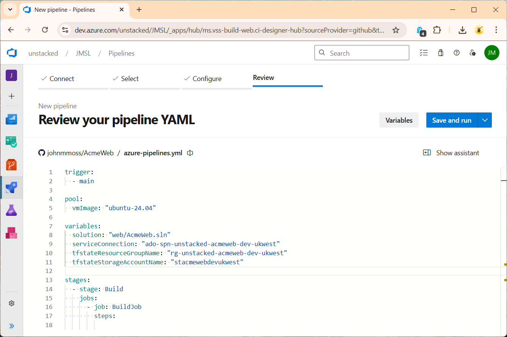
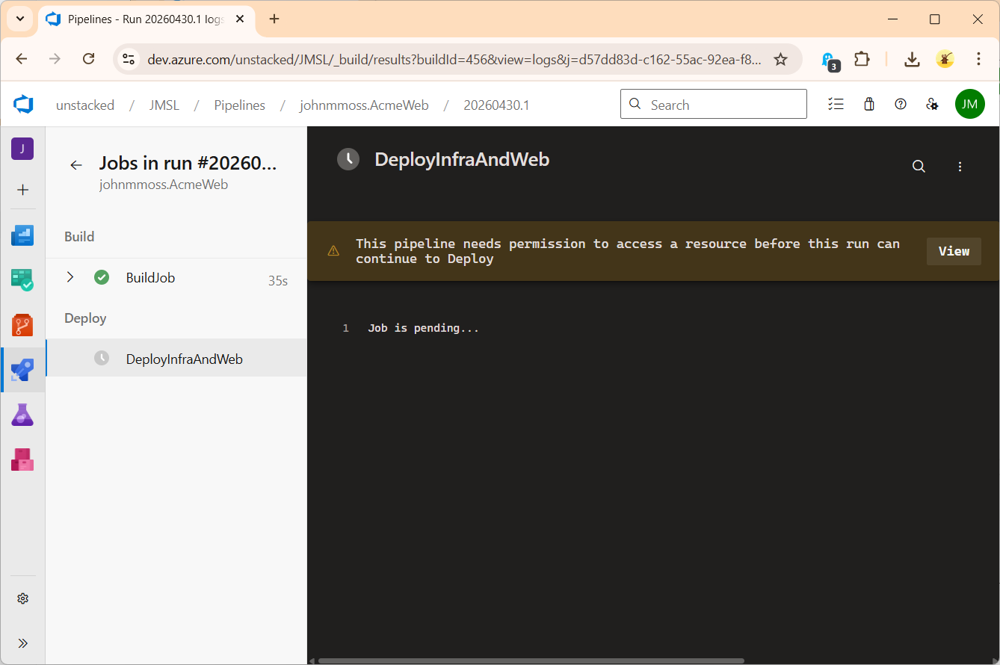

When it comes to deploying ASP.NET Core apps the list of technologies seems to explode as we start to think about deploying to the cloud. Azure, Azure DevOps and Terraform all work together to provide automated, continuous delivery pipelines and it can be a real challenge switching between these different technologies as we move from a developer role to think about operations. 

In this tutorial I walk through a simple barebones deployment with basic scaffolding for each area. We have a simple ASP.NET Core Web App that we deploy into a single Azure App Service using an Azure DevOps Pipeline. We use Terraform to describe the infrastructure which is applied by the pipeline. This results in three code artifacts:

* **Web App** - ASP.NET Core Razor Pages App
* **Infrastructure** - A single Terraform `main.tf`
* **Deployment** - An `azure-pipelines.yml` to build, and deploy the app and infra code.

We also have two manual, one time setup tasks:

* **Infra State** - Manually setup Terraform state
* **Pipeline Setup** - Manually setup in Azure DevOps once the code artifacts are done.

## Manually Setup Terraform State

We need to store the Terraform state in an Azure Storage Container so that it's persisted across deployments. To do this we manually create the following resources in Azure:

* The resource group: `rg-unstacked-acmeweb-dev-ukwest`
* The storage account: `stacmewebdevukwest`
* The storage container: `tfstate`

You can run the following PowerShell - don't forget to login first:

```powershell
$REGION = 'ukwest'
$RESOURCE_GROUP_NAME='rg-unstacked-acmeweb-dev-ukwest'
$STORAGE_ACCOUNT_NAME="stacmewebdevukwest"
$CONTAINER_NAME='tfstate'
#
# Create resource group
#
az group create --name $RESOURCE_GROUP_NAME --location $REGION
#
# Create storage account
#
az storage account create --resource-group $RESOURCE_GROUP_NAME --name $STORAGE_ACCOUNT_NAME --location $REGION --sku Standard_LRS
#
# Create blob container
#
az storage container create --name $CONTAINER_NAME --account-name $STORAGE_ACCOUNT_NAME --verbose
```

**Notes** 

* In this tutorial we use the free tier for our App Service Plan. You can only have one free tier per region, so you might need to change `ukwest` if that's already used. See the [List of Regions](https://learn.microsoft.com/en-us/azure/reliability/regions-list?tabs=all) available.
* For the sake of this demo, names of course do not really matter. However, I am starting to get quite a few resources in my personal Azure subscription so decided to start being a bit more organised. It's worth having a read of the Microsoft [naming conventions](https://learn.microsoft.com/en-us/azure/cloud-adoption-framework/ready/azure-best-practices/resource-naming) and [resources abbreviations](https://learn.microsoft.com/en-us/azure/cloud-adoption-framework/ready/azure-best-practices/resource-abbreviations) for guidance.

## Create the Web App and Git Repo

We start by creating a git repo and adding a new ASP.NET Web App using the `webapp` template to a `web` folder in the repository root. It's worth building and running locally to check all is well.

We also need files for the Terraform `infra/main.tf` and `azure-pipelines.yml` for the Pipelines Yaml which we will fill out later. 

The file structure should look like below. It's important to match this pattern because the `azure-pipelines.yaml` file relies on this structure:

```
<repo>:
|   azure-pipelines.yml
|
+---infra
|       main.tf
|
+---web
    |   .gitignore
    |   global.json
    |   AcmeWeb.sln
    |
    +---AcmeWeb
        |   AcmeWeb.csproj
        |   Program.cs
		|   ...	  
```

Push the repo to GitHub so that the pipeline can read the repo in the appropriate step below.

## Write Terraform Code to build the Infrastructure

Our simple web app only requires two artifacts, an App Service Plan and an App Service. The code for `infra/main.tf` to add/commit/push:

```
terraform {

  required_providers {
    azurerm = {
      source  = "hashicorp/azurerm"
      version = "~> 4.61.0"
    }
  }

  backend "azurerm" {
    resource_group_name  = "rg-unstacked-acmeweb-dev-ukwest"
    storage_account_name = "stacmewebdevukwest"
    container_name       = "tfstate"
    key                  = "terraform.tfstate"
  }
}

provider "azurerm" {
  features {}
}

data "azurerm_resource_group" "rg" {
  name = "rg-unstacked-acmeweb-dev-ukwest"
}

resource "azurerm_service_plan" "plan" {
  name                = "asp-unstacked-acmeweb-dev-ukwest"
  resource_group_name = data.azurerm_resource_group.rg.name
  location            = data.azurerm_resource_group.rg.location
  sku_name            = "F1"
  os_type             = "Windows"
}

resource "azurerm_windows_web_app" "web" {
  name                = "app-unstacked-acmeweb-dev-ukwest"
  resource_group_name = data.azurerm_resource_group.rg.name
  location            = azurerm_service_plan.plan.location
  service_plan_id     = azurerm_service_plan.plan.id

  identity {
    type = "SystemAssigned"
  }
  
  app_settings = {
    # Deploy step sets these settings:
    "WEBSITE_RUN_FROM_PACKAGE" = "1"
    "WEBSITE_ENABLE_SYNC_UPDATE_SITE" = "true" 
  }


  site_config {
    always_on = false

    application_stack {
      current_stack  = "dotnet"
      dotnet_version = "v8.0"
    }
  }
}

output "app_service_name" {
  value = azurerm_windows_web_app.web.name
}
```

* We already created a resource group when we bootstrapped the Terraform state, so we use the `data` keyword reference it.
* The `backend` section is setup with the details from above so our Terraform state will be persisted in the Azure Storage container. It's worth noting that the storage container is not tracked by Terraform.
* We've got a single file for our Terraform, which is fine for such a small project. But really we would want to structure the Terraform differently with separate files for resources, variables and modules. For now though, this suits our purpose.

## Write Azure Pipelines Yaml 

Now our Azure Pipeline code. We have the following for our `azure-pipelines.yaml` to add/commit/push:

```yaml
trigger:
  - main

pool:
  vmImage: "ubuntu-24.04"

variables:
  solution: "web/AcmeWeb.sln"
  serviceConnection: "ado-spn-unstacked-acmeweb-dev-ukwest"
  tfstateResourceGroupName: "rg-unstacked-acmeweb-dev-ukwest"
  tfstateStorageAccountName: "stacmewebdevukwest"

stages:
  - stage: Build
    jobs:
      - job: BuildJob
        steps:

          - task: UseDotNet@2
            displayName: 'Use .NET 8'
            inputs:
              version: '8.0.x'

          - pwsh: dotnet restore $(solution)
            displayName: 'Restore'

          - pwsh: dotnet build $(solution) --configuration Release --no-restore
            displayName: 'Build'

          - pwsh: dotnet publish $(solution) --configuration Release --no-build --output $(Build.ArtifactStagingDirectory)/publish
            displayName: 'Publish'

          - task: ArchiveFiles@2
            displayName: 'Compress Web App'
            inputs:
              rootFolderOrFile: '$(Build.ArtifactStagingDirectory)/publish'
              includeRootFolder: false
              archiveType: 'zip'
              archiveFile: '$(Build.ArtifactStagingDirectory)/web.zip'
              replaceExistingArchive: true

          - task: PublishPipelineArtifact@1
            displayName: "Publish Artifact (web)"
            inputs:
              targetPath: "$(Build.ArtifactStagingDirectory)/web.zip"
              artifact: "drop_web"

          - task: PublishPipelineArtifact@1
            displayName: "Publish Artifact (infra)"
            inputs:
              targetPath: "$(Build.SourcesDirectory)/infra"
              artifact: "drop_infra"

  - stage: Deploy
    dependsOn: Build
    jobs:
      - deployment: DeployInfraAndWeb
        environment: "ado-env-acmeweb-dev" 
        strategy:
          runOnce:
            deploy:
              steps:
                - download: current
                  artifact: drop_infra
                - download: current
                  artifact: drop_web

                - task: TerraformInstaller@1
                  displayName: "Install Terraform"
                  inputs:
                    terraformVersion: "1.7.0"

                - task: TerraformTaskV4@4
                  displayName: "Terraform Init"
                  inputs:
                    provider: "azurerm"
                    command: "init"
                    workingDirectory: "$(Pipeline.Workspace)/drop_infra"
                    backendServiceArm: "$(serviceConnection)"
                    backendAzureRmResourceGroupName: "$(tfstateResourceGroupName)"
                    backendAzureRmStorageAccountName: "$(tfstateStorageAccountName)"
                    backendAzureRmContainerName: "tfstate"
                    backendAzureRmKey: "terraform.tfstate"

                - task: TerraformTaskV4@4
                  displayName: "Terraform Apply"
                  inputs:
                    provider: "azurerm"
                    command: "apply"
                    workingDirectory: "$(Pipeline.Workspace)/drop_infra"
                    environmentServiceNameAzureRM: "$(serviceConnection)"
                    commandOptions: "-auto-approve"

                - task: AzureCLI@2
                  displayName: "Capture Terraform Variables"
                  inputs:
                    azureSubscription: "$(serviceConnection)"
                    scriptType: "pscore"
                    scriptLocation: "inlineScript"
                    workingDirectory: "$(Pipeline.Workspace)/drop_infra"
                    inlineScript: |
                      $appServiceName = terraform output -raw app_service_name
                      Write-Host "App Service name: $appServiceName"
                      Write-Host "##vso[task.setvariable variable=webAppName]$appServiceName"

                - task: AzureRmWebAppDeployment@4
                  displayName: "Deploy Azure App Service"
                  inputs:
                    ConnectionType: "AzureRM"
                    azureSubscription: "$(serviceConnection)"
                    appType: "webApp"
                    WebAppName: "$(webAppName)"
                    Package: "$(Pipeline.Workspace)/drop_web/**/*.zip"

```

**Notes**

* As already mentioned this is a basic template to get started. There are no tests, there is no review stage for the Terraform and we just have a single environment.
* The build step uses `dotnet` CLI commands in PowerShell steps, manually zips the output and publishes two artifacts for the infrastructure code and web app using the `PublishPipelineArtifact` task.
* I created the `ado-spn-unstacked-acmeweb-dev-ukwest` service connection using the [automatic](https://learn.microsoft.com/en-gb/azure/devops/pipelines/library/connect-to-azure?view=azure-devops#create-an-app-registration-with-workload-identity-federation-automatic) method. This can be a bit fiddly. See my previous post: [Setting Up an Azure DevOps Service Connection with a Service Principal](https://unstacked.net/articles/azure-devops-service-connection-service-principal) for a manual approach.
* The script uses a [deployment job](https://learn.microsoft.com/en-us/azure/devops/pipelines/process/deployment-jobs?view=azure-devops) to run the Terraform and push the Web app to the App Service which in turn uses an environment. I called my environment `ado-env-acmeweb-dev`. This will get created automatically at run time see Azure Devops -> Pipelines
* The Terraform tasks `TerraformInstaller` and `TerraformTaskV4` are from the [Terraform Marketplace Extension](https://marketplace.visualstudio.com/items?itemName=ms-devlabs.custom-terraform-tasks) .
* The Terraform step `Capture Terraform Variables` reads out the name of the newly created App Service and passes it into the deployment task. So the name of the `azure-pipelines.yml` script does not need to know about this concern.

## Setup Azure DevOps Pipeline

Now that the code is written for each of the artifacts we are ready to manually create the Azure DevOps Pipeline. I do this as a  manual step in the Azure DevOps portal. Navigate to the Azure DevOps Pipelines click New pipeline and select GitHub and pick the repo out of the list. It should find you `azure-pipelines.yml` if it's in the root of the direction:



Click Run. The first time the pipeline runs, you will need to give permission to access the environment. If the environment does not exist, then it should be automatically created when the pipeline is run. See [Create and target Azure DevOps environments](https://learn.microsoft.com/en-us/azure/devops/pipelines/process/environments?view=azure-devops) for more information about environments.



## Summary

This tutorial walked through setting up an automated deployment pipeline for a simple dotnet core Web App using Azure DevOps. The walk through shows how to use Terraform to build the infrastructure which is run in a single apply step in the pipeline. We did bootstrap the Terraform state by manually creating a resource group, storage account and storage container to store the `tfstate` which means the state persists over multiple runs.

This is a basic, barebones setup for learning or a starting point for a POC. The Web App doesn't do anything, the Terraform is auto-approved in the pipeline, we don't have any environments, so there's a lot to do to get this ready for production scenarios. However, it does join the dots between the different technologies and provide a good springboard for more advanced topics. 

