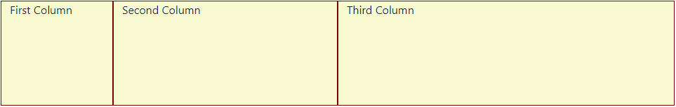
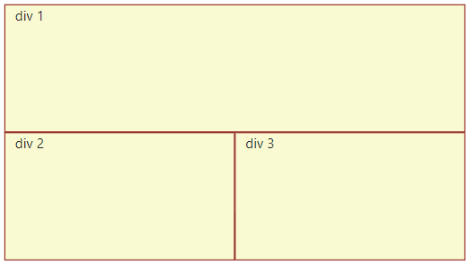
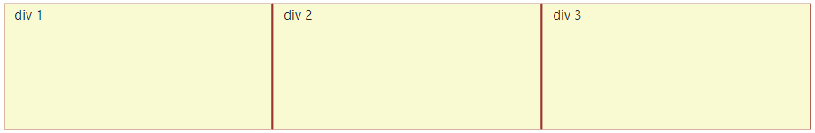

Recently I watched Shawn Wildermuth's Pluralsight course [Creating a Responsive Layout with Bootstrap Grid](https://app.pluralsight.com/library/courses/bootstrap-grid-creating-responsive-layout/table-of-contents) and he does a great job of explaining how bootstrap grid can be used to create responsive designs. Before looking at how to make our layouts responsive, first lets just recap the basics.

### Bootstrap Grid System

The [bootstrap documentation](https://getbootstrap.com/docs/5.2/layout/grid/) explains the basic Grid System. The idea is to do use the `row` class to denote... well a row :) and `col` to denote the columns. A basic grid layout can be as simple as:

```html
<div class="container">
  <div class="row">
    <div class="col">1 of 2</div>
    <div class="col">2 of 2</div>
  </div>
</div>
```

The grid system starts to get useful because we can specify the width of each column by adding a number to our `col` class. The numbers are to add up to 12, anything over 12 will spill over to a new row:

```html
<div class="container">
  <div class="row">
    <div class="col-2">First Column</div>
    <div class="col-4">Second Column</div>
    <div class="col-6">Third Column</div>
  </div>
</div>
```

The above columns would produce a layout similar to:



The other useful feature that bootstrap provides is the [responsive breakpoints](https://getbootstrap.com/docs/5.2/layout/breakpoints/) that use media queries to enable styles to be conditionally applied at different screen sizes. The [documentation](https://getbootstrap.com/docs/5.2/layout/breakpoints/#available-breakpoints) explains the details, but briefly there are six infixs that can be used with the `col` class. Here are some examples:

| Class       | Description                                                           |
| ----------- | --------------------------------------------------------------------- |
| `.col`      | This is the default size and styles the smallest screens (&lt;576px)  |
| `.col-sm-6` | For small size screens ( &ge; 576px) this `div` will take up 6 spaces |
| `.col-lg-3` | For large size screens ( &ge; 992px) this `div` will take up 3 spaces |

We can combine these classes to produce a responsive design.

### Responsive Layout with `.col`s

Bootstrap is mobile first, the theory being that smaller less powerful devices only need to apply the bare minimum of styles. More progressive enhancements get layered on top to adjust for increasingly larger devices.

So the `.col` class describes the behaviour for the smallest screens, screens that are &lt;576px. If we also include a `.col-sm` tag in the same `div` then this tells that `div` how the screen looks for small screens (screens &ge;576px.) By combining these classes we can design different views for the different sizes of screens.

So `.col-12` dictates how the columns will behave on an extra small device. Yes... it will look crap on a big display if this is all you apply! `.col-sm-6` says at a small screen size this container will take up 6 spaces and `.col-lg-3` says at a large screensize the container will take up 3 spaces.

You can apply multiple `col` classes and the content will change at each breakpoint - which is super cool. Consider the following html:

```html
<div class="container">
  <div class="row">
    <div class="col-12 col-lg-4">div 1</div>
    <div class="col-12 col-sm-6 col-lg-4">div 2</div>
    <div class="col-12 col-sm-6 col-lg-4">div 3</div>
  </div>
</div>
```

- By default on extra small screens the columns appear as three seperate rows.

- When the screen goes above 576px it becomes a small screen and the top row stays but the bottom two rows join into a single row equally spaced apart:

  

- When the screen goes above &ge;992px the screen is now large and the three rows become three equally spaced columns:

  

### Bootstrap Responsive Utility Classes

So the grid system and breakpoints make it nice and easy to create these responsive designs. But wait, there's more... these breakpoints can also be applied to many of the Bootstrap utilities:

- [Margin and Padding](https://getbootstrap.com/docs/5.2/utilities/spacing/#notation)
- [Display](https://getbootstrap.com/docs/5.2/utilities/display/#hiding-elements)
- [Float](https://getbootstrap.com/docs/5.2/utilities/float/#responsive)

Lets consider the display utillities:

- `.d-block`
- `.d-none`
- `.d-inline`
- `.d-inline-block`

They can be combined with the breakpoints like so:

- `.d-sm-block`
- `.d-lg-none`

Lets see these in action, consider the html below.

```html
<div class="row">
  <div class="d-none d-sm-block col-sm-6">
    
  </div>
  <div class="col-12 col-sm-6">
    <p class="lead">
      Hello, this is me and I am really awesome. I want this text to take up
      more space on a bigger screen. So the image will be smaller and the
      content bigger.
    </p>
  </div>
</div>
```

On extra small screens, screens &lt; 576px, the avatar will not be shown because we have used `d-none`. However we have also used the `d-sm-block` class, so the avatar will be displayed when the screen size goes above 576px. Note, we also have added the `col-sm-6` class to both `div`s so each will be shown side-by-side, taking up equal space on the screen.

### Conclusion

I've been using Bootstrap for a long time, but had never fully understood how to create responsive designs by combining the different classes to create different views for different screen sizes. Shawn's video was a real eureka moment and I applied what I learn't to this website. If you load up the homepage and resize the browser you will see the content realigning as the various breakpoints are hit. Happy days!
