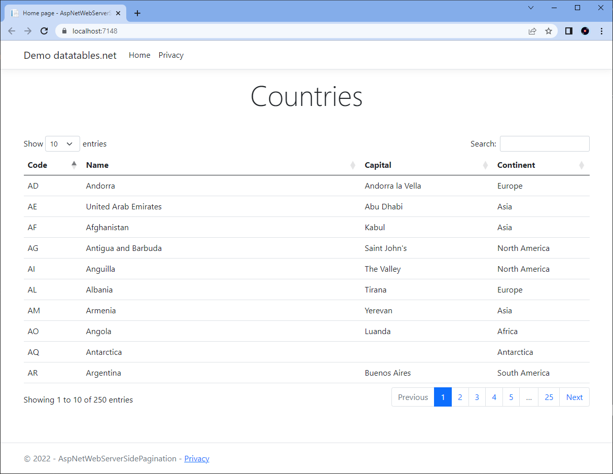
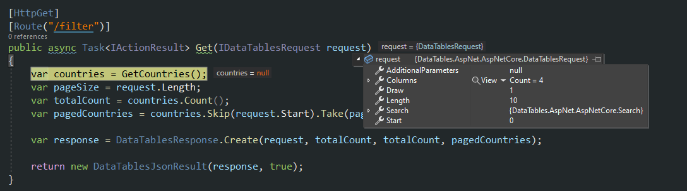
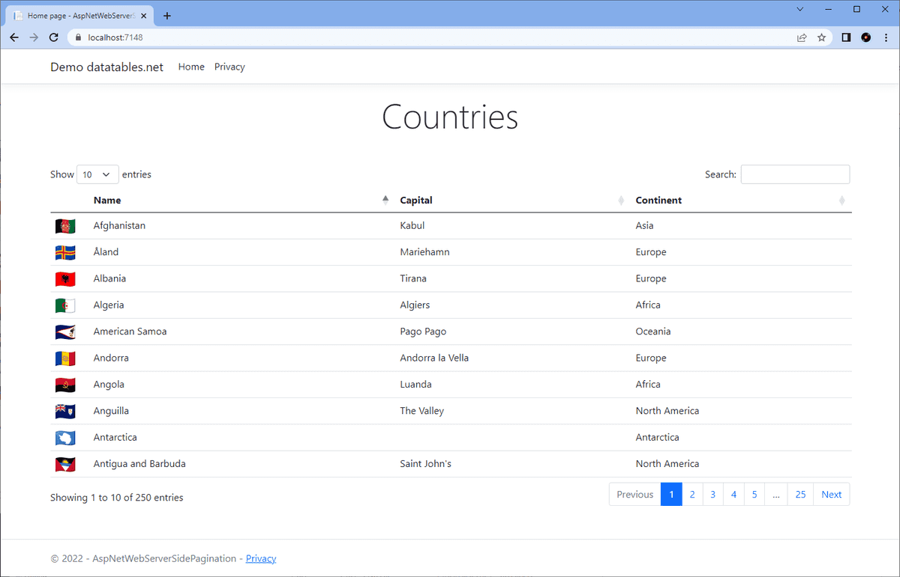

Software systems often have to display a lot of data and people expect functionality like pagination, searching and sorting by default. The [jQuery plugin datatables.net](https://datatables.net/) transforms a basic HTML table with a few lines of code into a fully functional data grid. Its pretty awesome!

A few lines of code gets you up and running with a client-side solution which is not ideal for large datasets but, the plugin also supports server-side scenarios although some custom code to page, sort and filter your data.

A final version of this tutorial code is available [available on GitHub](https://github.com/johnmmoss/AspNetCore-Samples/tree/main/AspNetWebServerSidePagination).

### Getting Started

I decided to use the data provided by [annexare.com](https://annexare.com/) in their [countries-list](https://www.npmjs.com/package/countries-list) `npm` package to demo this control. You can access the data as a CSV from the project's [github repo](https://github.com/annexare/Countries/blob/master/dist/countries.csv).

Start by creating an ASP.NET Core Web App and add the following code to the `Index.chtml.cs` page's `OnGet` method to read the data from the data file:

```c#
var path = @"Data\countries.csv";
using (var reader = new StreamReader(path))
using (var csv = new CsvReader(reader, CultureInfo.InvariantCulture))
{
	Countries = csv.GetRecords<Country>().ToList();
}
```

**Notes**

- The above code uses the [CsvHelper](https://joshclose.github.io/CsvHelper/getting-started/) library to read the CSV file.
- The standard ASP.NET Core Web App template has jQuery and Bootstrap already installed.

The above code uses a `Country` class:

```c#
public class Country
{
	public string Code { get; set; }
	public string Name { get; set; }
	public string Continent { get; set; }
	public string Capital { get; set; }
}
```

Next, we add some code to the Razor view `Index.cshtml`:

```html
<table id="countries" class="table">
  <thead>
    <tr>
      <th>Code</th>
      <th>Name</th>
      <th>Capital</th>
      <th>Continent</th>
    </tr>
  </thead>
  <tbody>
    @foreach(var country in Model.Countries) {
    <tr>
      <td>@country.Code</td>
      <td>@country.Name</td>
      <td>@country.Capital</td>
      <td>@country.Continent</td>
    </tr>
    }
  </tbody>
</table>
```

To setup datatables.net we need to add the script file and the CSS file for the styles. You can download the relevant files using the [datatables.net download builder](https://datatables.net/download/). I decided to use Bootstrap 5 styling to match the Web App styling and used a CDN rather the a package manager.

So add the styles to the header and the script goes towards the bottom of the page beneath the jQuery reference:

```html
<link
  rel="stylesheet"
  type="text/css"
  href="https://cdn.datatables.net/v/bs5/dt-1.13.1/datatables.min.css"
/>

<script
  type="text/javascript"
  src="https://cdn.datatables.net/v/bs5/dt-1.13.1/datatables.min.js"
></script>
```

That's the jQuery datatables.net plugin installed, so now we just need to add the appropriate JavaScript to the to make the magic happen. On the page with the above HTML table, add the following:

```html
<script>
  $(document).ready(function () {
    $("#countries").DataTable();
  });
</script>
```

The HTML table should transform from one big boring table into a nicer styled version with pagination, searching and sorting included all provided as shown below:



Looking good! We've hardly written any code and yet we have a full featured data grid up and running in next to no time. But of course this data is all client side and this solution will not scale for larger datasets. Lets see how we can use the datatables.net server side processing functionality to improve the solution.

### Server-side Processing

So far we have not had to write too much code, but for the server side processing solution we do have to implement code to page, search and sort our dataset. Lets start by installing a nuget package that can help with that:

```powershell
Install-Package DataTables.AspNet.AspNetCore -Version 2.0.2
```

We need to register the datatables.net helpers before we can uses them. My Net 6.0 Web App requires the following to be added to `Program.cs`:

```c#
builder.Services.RegisterDataTables();
```

Now create a new API controller `CountriesController.cs` and add the following endpoint:

```c#
[HttpGet]
[Route("/filter")]
public async Task<IActionResult> Get(IDataTablesRequest request)
{
	var countries = GetCountries();
	var pageSize = request.Length;
	var totalCount = countries.Count();
	var pagedCountries = countries.Skip(request.Start).Take(pageSize);

	var response = DataTablesResponse.Create(request, totalCount, totalCount, pagedCountries);

	return new DataTablesJsonResult(response, true);
}
```

**Notes**

- So now we are writing logic to do the actual pagination of our countries collection - we no longer get this for free!
- `IDataTablesRequest` provides an abstraction for calls from the jQuery datatables.net control
- The `DataTables` package also provides `DataTablesResponse.Create` factory method and `DataTablesJsonResult` for the response data.

Before we can see the above code in action, we need to update our datatables.net control to use the serverside processing.

First delete all the rows from the HTML table in `Index.cshtml` , the plugin will add in the rows programmatically:

```html
<div class="mt-5">
  <table id="countries" class="table">
    <thead>
      <tr>
        <th>&nbsp;</th>
        <th>Name</th>
        <th>Capital</th>
        <th>Continent</th>
      </tr>
    </thead>
    <tbody></tbody>
  </table>
</div>
```

Next update the jQuery code in `Index.cshtml` to use server side processing like so:

```JavaScript
 $(document).ready(function () {
	$('#countries').DataTable({
		serverSide: true,
		ajax: {
			url: 'filter'
		},
		columns: [
			{ data: "code" },
			{ data: "name" },
			{ data: "capital" },
			{ data: "continent" }
		]
	});
});
```

**Note** the [datatables.net documentation](https://datatables.net/manual/server-side) says you only need to set the `serverSide` and `ajax` properties, but I could not get this to work.

If you've got this far then when you run the above solution the webpage that loads will look the same as before. But, stick a break point on the API endpoint and lets see what happens:



Nice, server side pagination done! Now we can use large datasets with this control and not worry about long load times. Of course, we still have a bit of work to do to get sorting and searching working.

### Implementing Server-side Searching

We read the `searchTerm` from `request.Search.Value`. The code below implements search using LINQ to search the `Name`, `Capital` and `Continent` columns of the countries and only returns values where there are a match.

```c#
var searchedCountries = string.IsNullOrEmpty(searchTerm)
	? countries
	: countries.Where(x => x.Name.Contains(searchTerm, StringComparison.CurrentCultureIgnoreCase) ||
						   x.Capital.Contains(searchTerm, StringComparison.CurrentCultureIgnoreCase) ||
						   x.Continent.Contains(searchTerm, StringComparison.CurrentCultureIgnoreCase)).ToList();
```

Of course, the search is empty initially, so we also need to wrap the search in a `null` check to ensure that the search code only runs when we actually have a search value - otherwise we will get an exception!

### Implementing Server-side Sorting

For server-side sorting, the `IDataTablesRequest` provides a collection `Column` objects, each of which has a `Sort` property. If sort has been selected then the `Sort` property is set and contains the `SortDirection`:

```c#
IEnumerable<Country> sortedAndSearchedCountries;

switch (sortField)
{
	case "capital":
		sortedAndSearchedCountries = sortDirection == SortDirection.Ascending
			? searchedCountries.OrderBy(x => x.Capital)
			: searchedCountries.OrderByDescending(x => x.Capital).ToList();
		break;
	case "continent":
		sortedAndSearchedCountries = sortDirection == SortDirection.Ascending
			? searchedCountries.OrderBy(x => x.Continent)
			: searchedCountries.OrderByDescending(x => x.Continent);
		break;
	default:
		sortedAndSearchedCountries = sortDirection == SortDirection.Ascending
			? searchedCountries.OrderBy(x => x.Name)
			: searchedCountries.OrderByDescending(x => x.Name);
		break;

}
```

### Review the Server-side Pagination

Yes, we did implement server-side pagination above. However, we need to update the pagination code above so that it takes into account the filtered data. When we create the response, we now differentiate between the `totalCount` and the `totalRecordsFilteredCount`. When the search box is used, both counts are displayed on the grid:

```c#
var pagedGridData = sortedAndSearchedCountries
						.Skip(request.Start)
						.Take(request.Length)
						.ToList();

var totalCount = countries.Count();
var totalRecordsFiltered = searchedCountries.Count();
var response = DataTablesResponse.Create(request, totalCount, totalRecordsFiltered, pagedGridData);
```

Adding in the above code excerpts implements the code for server-side pagination, searching and sorting. The grid actually looks the same as in the screenshot above. To finish off lets replace the first column, the country code, with the countries flag.

### Adding Flags

As you can see from the [datatables.net documentation](https://datatables.net/), the plugin is highly configurable. Lets explore what else is on offer by adding country flags to the data.

[Flagapeida](https://flagpedia.net/download/icons) has country flag images and I downloaded the [mini waving flags (32x24px)](https://flagcdn.com/32x24.zip) images and unzipped them to the `wwwroot\images\flags` directory in Visual Studio.

Next update the `Index.cshtml` JavaScript code like so:

```javascript
$(document).ready(function () {
  $("#countries").DataTable({
    serverSide: true,
    ajax: {
      url: "filter",
    },
    columns: [
      { data: "code", render: getFlagImage },
      { data: "name" },
      { data: "capital" },
      { data: "continent" },
    ],
    order: [[1, "desc"]],
    columnDefs: [{ targets: [0], orderable: false }],
  });

  function getFlagImage(flagCode) {
    console.log(flagCode);
    return ``;
  }
});
```

**Notes**

- We add the `getFlagImage` function which builds the `img` tag and returns the HTML to display the flag image instead of the code.
- The `columnDefs` field has been added and this stops the first column from being sorted. It doesn't make much sense to sort images.
- Finally, we set a default order using the `order` property. By default our grid is sorted by `Name` ascending.

With these changes made the grid looks a little more exciting:



### Conclusion

The datatables.net jQuery plugin provides a great quick way to get client side pagination, searching and sorting enabled on an HTML table. However client side solutions are not a great fit for large datasets.

Fortunately the datatables.net plugin has the features to accommodate server-side processing and although it does require the writing of some custom code this is made easier with the help of the `DataTables.AspNet.AspNetCore` package.

A final version of this tutorial code is [available on GitHub](https://github.com/johnmmoss/AspNetCore-Samples/tree/main/AspNetWebServerSidePagination) and for more information on the datatables.net plugin checkout its extensive documentation:

- [datatables.net](https://datatables.net/)
- [datatables.net Examples](https://datatables.net/examples/index)
- [datatables.net Server-side Processing](https://datatables.net/manual/server-side)
