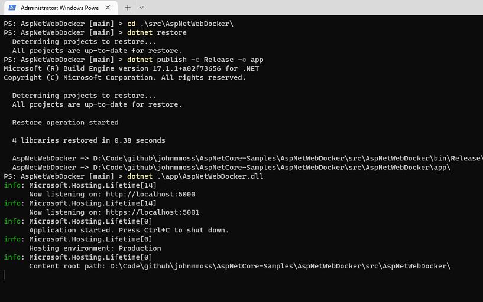
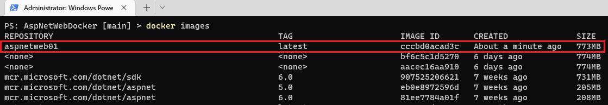
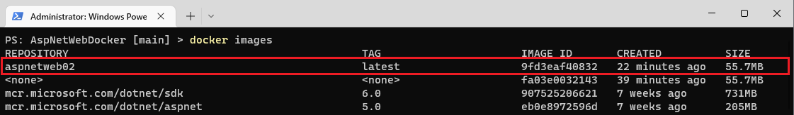

Visual Studio provides excellent support for docker containers, but this does mean some of the complexities of the technology can get masked. In this tutorial we walk through the basics of building a docker container for a simple ASP.NET Core Web Application so that we can better understand the underlying principles of docker.

### Docker Overview

Docker is a containerisation technology that consists of images and containers. An image is a read-only template with instructions for creating a Docker container. A container is a runnable instance of an image. To build an image we write a Dockerfile which has a simple syntax for defining the required steps. You can learn more about docker from the official documentation:

- [Docker Overview](https://docs.docker.com/get-started/overview/)
- [Dockerfile reference](https://docs.docker.com/engine/reference/builder/)
- [docker build](https://docs.docker.com/engine/reference/commandline/build/)
- [docker run](https://docs.docker.com/engine/reference/commandline/run/)

In order to build and run docker containers you need to install [Docker Desktop](https://docs.docker.com/desktop/).

### Creating the Application

Before we create our application a quick word about the solution structure. One of the benefits of docker is that it helps to separate the application from its infrastructure. Consequently we will create two folders in the root of our repository one for our source code and the other for the docker related files.

At the root of our repository, create a `src` folder, for our application, and a `docker` folder, for our infrastructure.

Next create a .net 6.0 website using the ASP.NET Core Web App template called `AspNetWebDocker` in the `src` folder and add an empty file called `Dockerfile` in the `docker` folder. We will write the `Dockerfile` shortly. The directory structure should now look similar to below:

```
C:\AspNetWebDocker
├───docker
│       Dockerfile
│
└───src
    │   AspNetWebDocker.sln
    │
    └───AspNetWebDocker
```

### Building the Solution

In the `Dockerfile` we are going to write the steps to restore, build and then run our application. Before writing and running the container, its worth running the same steps in a console window to check everything works. Execute the equivalent commands below:

```powershell
cd .\src\AspNetWebDocker\
dotnet restore
dotnet publish -c Release -o app
dotnet .\app\AspNetWebDocker.dll
```

If you execute these commands in the terminal, you should see something like below:



Now that we know what commands we need to run, we can write the `Dockerfile`.

### Building the Docker Image

Before we can run our container we need to build an image and we create an image by building it from a `Dockerfile`. So the next step is to write a `Dockerfile`.

A `Dockerfile` is a series of commands that the docker build command uses to create an image. Copy the following text into the `docker/Dockerfile` we created above:

```dockerfile
FROM mcr.microsoft.com/dotnet/sdk:6.0 AS base
ENV ASPNETCORE_URLS=http://+:80
WORKDIR /app
COPY ./src .
RUN dotnet restore
RUN dotnet publish -c Release -o out
WORKDIR /app/out
ENTRYPOINT ["dotnet", "AspNetWebDocker.dll"]
```

For a complete overview of all `Dockerfile` commands you can see the docker documentation: [Dockerfile reference](https://docs.docker.com/engine/reference/builder/). A brief description of each step:

| Keyword                                                                    | Meaning                                                                                                                                     |
| -------------------------------------------------------------------------- | ------------------------------------------------------------------------------------------------------------------------------------------- |
| [FROM](https://docs.docker.com/engine/reference/builder/#from)             | Sets the base image that our image will be built from. Its pulled from a [docker repository](https://hub.docker.com/_/microsoft-dotnet-sdk) |
| [WORKDIR](https://docs.docker.com/engine/reference/builder/#workdir)       | Set the working directory for our new image to the app folder                                                                               |
| [COPY](https://docs.docker.com/engine/reference/builder/#copy)             | Copy all files from the src folder into our container                                                                                       |
| [RUN](https://docs.docker.com/engine/reference/builder/#run)               | Run the restore and publish commands creating the application files                                                                         |
| [WORKDIR](https://docs.docker.com/engine/reference/builder/#workdir)       | Set the working directory to the out folder just created                                                                                    |
| [ENTRYPOINT](https://docs.docker.com/engine/reference/builder/#entrypoint) | Start the `dotnet` application when the container starts                                                                                    |

Next we need to build the docker image from the `Dockerfile` using the `docker build` command. The docker client tools are provided as part of the [Docker Desktop](https://docs.docker.com/desktop/) application. We run the following command **from the root of our repository**:

```bash
docker build -f docker\Dockerfile -t aspnetweb01 .
```

- The `-f` switch specifies the path to the `Dockerfile`
- The `-t ` switch gives the new image the name `aspnetweb01`
- The `.` sets the build context to be the current folder

Once the image is built we can use the `docker images` command to see our newly built image in the local image repository:



Looks like our image has been built succesfully so now we can use it to run a container.

### Running the Container

We can use `docker run` command to start our new container using the image that we just created above as the template:

```bash
docker run -d -p 5051:80 --name webapp aspnetweb01
```

- The `-d` switch sets the container running in the background
- The `-p` switch maps the local port, the port of the container, to the port of the "host" system. We can access our new site on port 5051
- We also specify the name of the container `webapp` and also the name of the image `aspnetweb01`

So navigate to the url `http://localhost:5051` in your browser and you should see your website displayed. If you have any problems loading the website, try tailing the logs as described in the debugging section below.

**Note** on line 2 of the `Dockerfile` we specify that the the container should have an environment variable of `ASPNETCORE_URLS` with the value `http://+:80`. So our application binds to port 80 inside the container and we then use the `-p` switch map that to a port on the host system. We do need to specify this variable to avoid getting the following error:

```
Unable to bind to http://localhost:5000 on the IPv6 loopback interface: 'Cannot assign requested address'.
```

This error is because the kestral webserver cannot bind to the localhost IPv6 address. By specifying the environment variable it binds to `127.0.0.1` instead.

### Optimising the Container

Our simple `Dockerfile` does work, but for production scenarios we really want to try to get that image size down in order to optimise our container. There are a number of steps that we can take to do this:

- Use a musl linux base image like [alpine](https://www.alpinelinux.org/)
- Use [multi-stage docker builds](https://docs.docker.com/develop/develop-images/multistage-build/)
- Use the publish trimmed option `dotnet publish` options

The following `Dockerfile` uses these techniques and will create a much smaller image size:

```dockerfile
FROM alpine:3.15 AS base
  WORKDIR /app

FROM mcr.microsoft.com/dotnet/sdk:6.0 AS publish
  WORKDIR /src
  COPY . .
  WORKDIR /src/src/Web
  RUN dotnet restore "AspNetDockerWeb.csproj" --runtime linux-musl-x64
  RUN dotnet publish "AspNetDockerWeb.csproj" -c Release -o /app/publish /p:PublishTrimmed=true --runtime linux-musl-x64 --self-contained /p:DebugType=None

FROM base AS final
  ENV ASPNETCORE_URLS=http://+:80
  WORKDIR /app
  RUN apk update && \
      apk add libstdc++
  COPY --from=publish /app/publish .
  CMD ./AspNetDockerWeb
```

Before we build and run this image however, there is a further change that we need to make to our website. The code will currently error with a gobalization issue similar to:

```
Process terminated. Couldn't find a valid ICU package installed on the system. Set the configuration flag System.Globalization.Invariant to true if you want to run with no globalization support.
   at System.Environment.FailFast(System.String)
   at System.Globalization.GlobalizationMode.GetGlobalizationInvariantMode()
   at System.Globalization.GlobalizationMode..cctor()
```

To fix this issue we add a file at the root of the web project called **_runtimeconfig.template.json_** and add the json below. For more information review the related [github issue](https://github.com/dotnet/core/issues/2186#issuecomment-472629489):

```json
{
  "configProperties": {
    "System.Globalization.Invariant": true
  }
}
```

Now build the image as described above use the `docker images` command. The size has dropped from 773mb to 55.7mb



### Debugging the Container

Getting a docker container up and running can be a fiddly task. There are a couple of techniques to use to try to debug any issues.

Tail the logs to see what the application is doing:

```bash
docker logs webapp -f
```

Connect to the container to run shell commands.

```bash
# Debian
docker exec -it webapp bash

# Alpine
docker exec -it webapp sh
```

### Docker Commands Cheat sheet

The following commands have been used throughout this tutorial:

```bash
# Build the docker image:
docker build -f docker\Dockerfile -t aspnetweb01 .

# Run a docker container:
docker run -d -p 5051:80 --name webapp aspnetweb01
docker run -d -p 5050:5000 -e ASPNETCORE_URLS=http://+:5000 --name webapp aspnetweb01

# Show all containers:
docker ps -a

# Show all images:
docker images

# Stop the container and remove it and the image:
docker stop webapp
docker rm webapp
docker rmi aspnetweb01

# Tail the logs of the container:
docker logs webapp -f

# Log into the container:
docker exec -it webapp bash
```

### Conclusion

In this tutorial we started looking at how to build and run a basic Docker container before looking into a more useful multi-build, optimised scenario. This optimised image is a more realistic starting point for production systems but we have only scratched the surface of what Docker can be used for.

Debugging containers can be fiddly, and it might take some time to understand what the different commands in the `Dockerfile` is actually do but tailing the logs and connecting on to the container are two useful techniques to help.

Finally the Docker documentation is excellent and I strongly suggest having a read through to familiarise yourself with the concepts and how to write solutions for more complex scenarios. The links at the beginning of this article are a great starting point.
