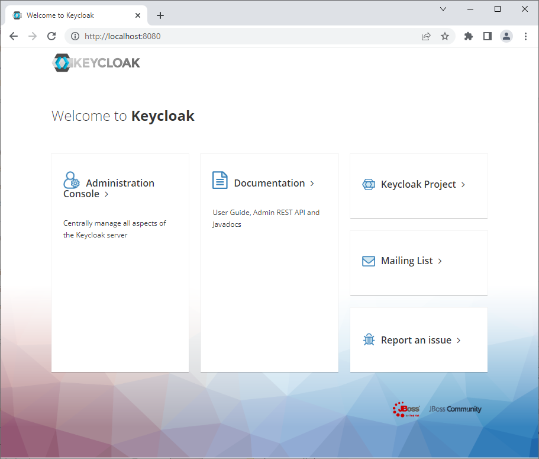
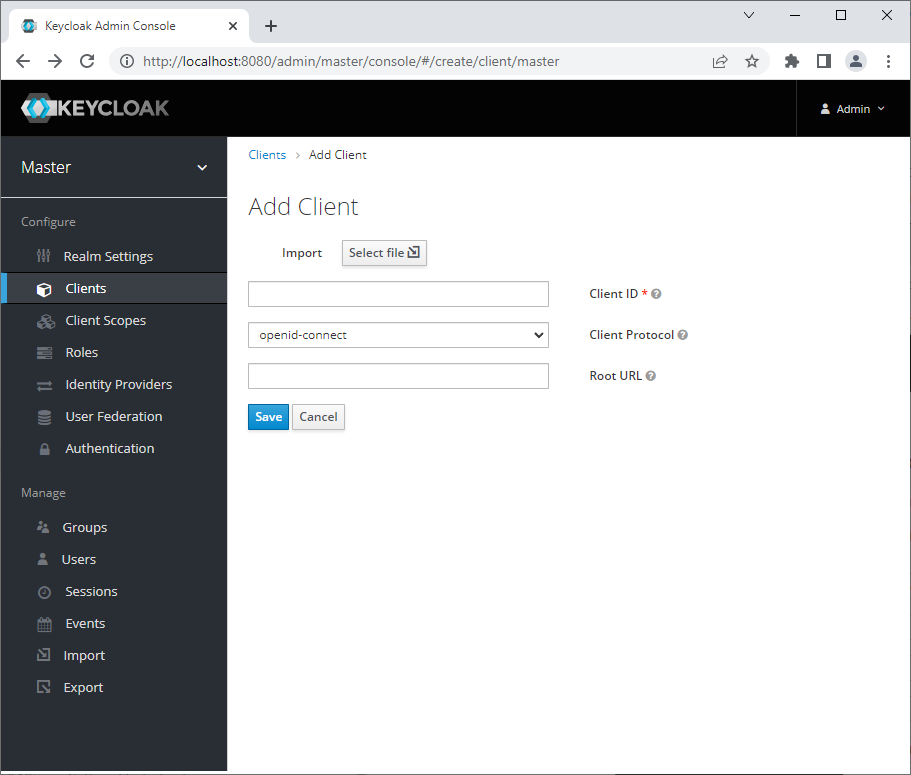
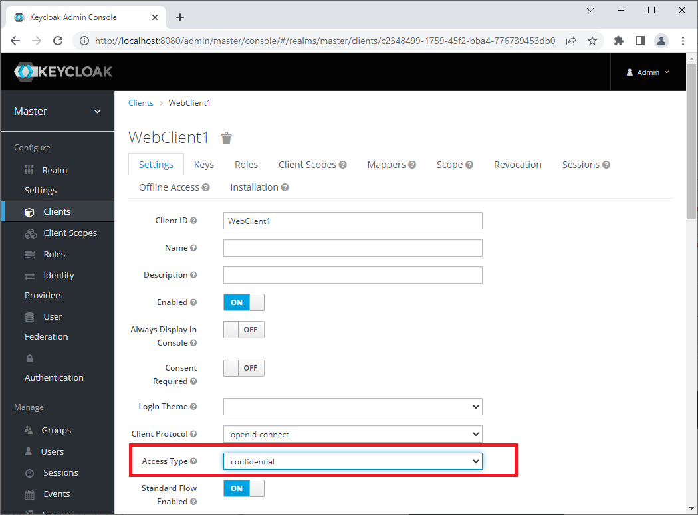
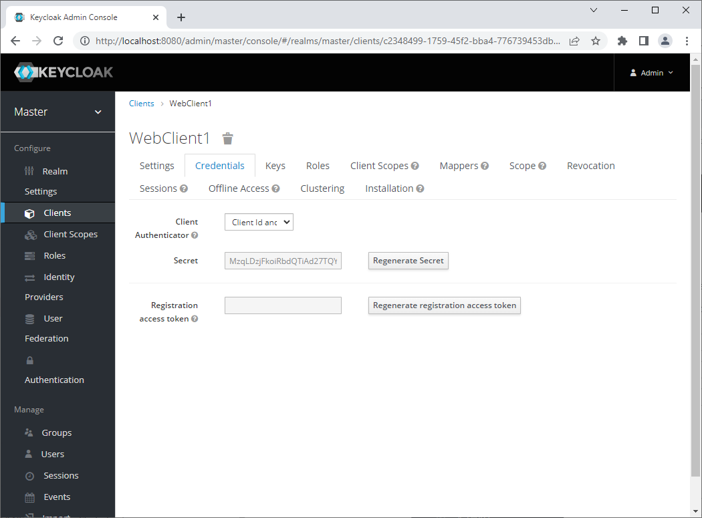
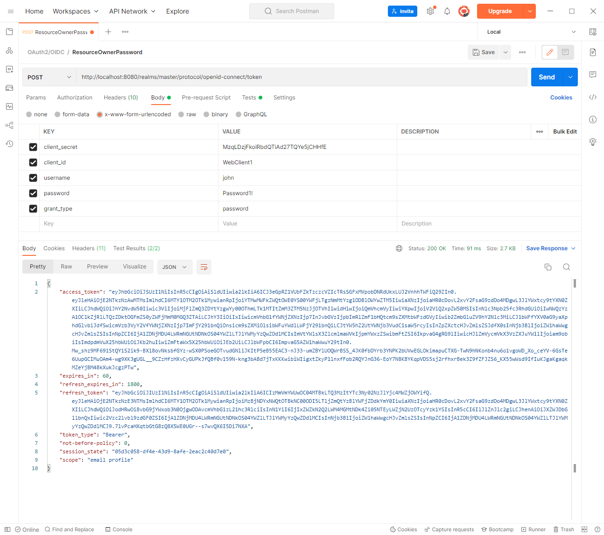
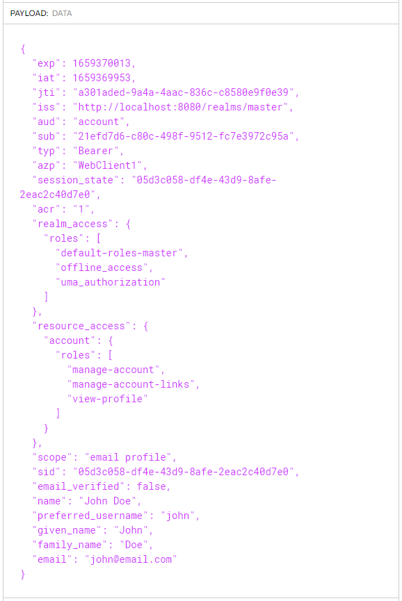
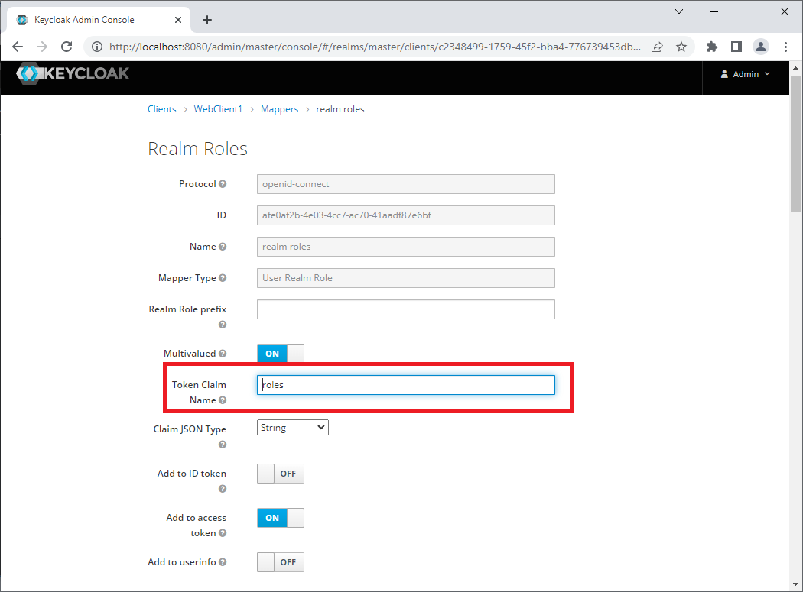
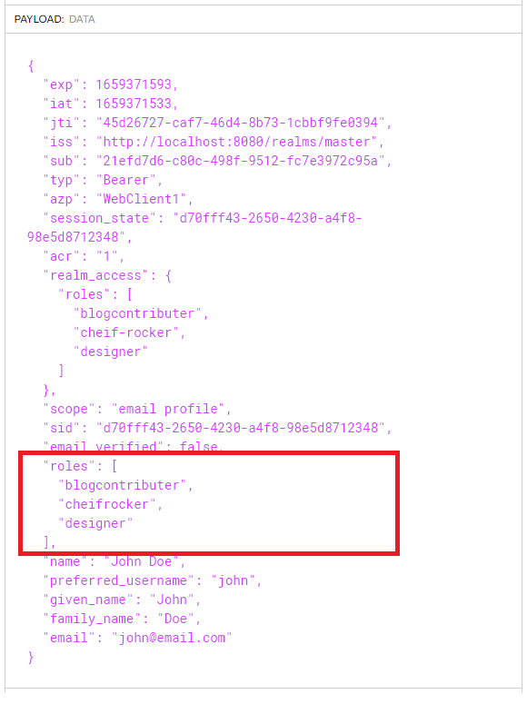

[Keycloak](https://www.keycloak.org/) is a full featured open source Identity and Access Management solution. Its written in Java and deployed with Docker meaning you can get up and running in minutes. It is ideal for for local development scenarios where we need a standards compliant (SAML 2.0, OAuth 2.0 or OpenID Connect) solution.

In this tutorial we will set Keycloak up using the bitnami wrapped docker container with `docker-compose` and configure the deployed solution so we can authorise with OAuth 2.0 flows using Postman.

* [Keycloak documentation](https://www.keycloak.org/documentation)
* [bitnami/keycloak](bitnami/keycloak)


### Setting up Keycloak

Long time users of docker-compose will be used to the drill by now. Save the following to a local file called  `docker-compose.yml`:

```yaml
version: "1"
services:
  identity:
    image: bitnami/keycloak:18.0.2
    restart: unless-stopped
    ports:
      - "8080:8080"
    environment:
      - KEYCLOAK_ADMIN_USER=admin
      - KEYCLOAK_ADMIN_PASSWORD=password
      - KEYCLOAK_DATABASE_HOST=identity-database
      - KEYCLOAK_DATABASE_NAME=keycloak
      - KEYCLOAK_DATABASE_USER=keycloak
      - KEYCLOAK_DATABASE_PASSWORD=keycloak
  identity-database:
    image: postgres:latest
    restart: unless-stopped
    environment:
      - POSTGRES_USER=keycloak
      - POSTGRES_PASSWORD=keycloak
      - POSTGRES_DB=keycloak
    volumes:
      - .\data\keycloak:/var/lib/postgresql/data
```

**Notes**

* Uses the [bitnami/keycloak](bitnami/keycloak) docker image pinned at version **18.0.2**
* Also uses a PostgreSQL  docker container which creates data locally in a `data\keycloak` folder.
* The environment variables are used to configure the containers - [see docs](https://hub.docker.com/r/bitnami/keycloak) for more info.
* The value `KEYCLOAK_DATABASE_HOST` points at the docker-compose node `identity-database`
* The Keycloak image comes in at **846mb** and PostgreSQL **315mb** so these are not small apps.

Executing the `up` command in a console window will pull down and run our Keycloak and PostgreSQL containers setting the various environment variables to configure accordingly:

```powershell
docker-compose up -d
```

It might take a few minutes on initial start-up to initialise the applications but on completion navigate to `http://localhost:8080` and you should see the Keycloak homepage:



**Note** if you run `docker-compose up` without the `-d` switch, the logs are printed to the console which helps with debugging. Alternatively, use `docker logs <container-name> -f`.

### Configuring Keycloak

Once the website is up and running, we now need to add a client and a user. 

Click the Administration Console link and enter the login credentials. You will see from our compose file above, the username is **admin** and the password is **password**. 

#### Add a Client

Click "Clients" in the menu on the left and the "Create" button. You will see a simple form shown below. Fill in a Client ID and click save:



On clicking save, you will be redirected to the settings of your newly created client. 

**Next**: 

1. Update the "Access Type" to "confidential" as shown in the screenshot below. 
2. Scroll down to "Valid Redirect URIs" and add an Asterix "*"
3. Scroll to the bottom of the page and click save. 



On clicking Save a new tab will appear called "Credentials":



The Credentials tab shows the secret, so now we have two of the values required for our OAuth 2.0 authorisation request - the client name and the client secret.

#### Add a User

We already have an admin user setup, but that user is not configured to authenticate by default. We will add a new user to be used in our dev system instead.

If you click the "Users" link in the left hand side menu below "Manage" (not "Providers"!) you will see the current Users listed. Click the "Add user" button and add  a username and email address and click Save.

Once the user is created, once again click the "Credentials" tab. By default, a temporary password is set. So:

1. Enter a password in both the "Password" and "Password Confirmation" boxes
2. Click "Set password" to save the password entered above.
3. Click "ON" next to "Temporary Password" to turn the temp password off.

If you try logging in to the Admin Console to test your new user, it will work, but you will see a page saying that you do not have permission to access the console. A better test is to request a token via the token endpoint using 

### Testing Keycloak

Now that we have completed the configuration, we have the necessary details from the credentials pages to request an access token from our IDP:

| Setting        | Value                                                        |
| -------------- | ------------------------------------------------------------ |
| Token Endpoint | http://localhost:8080/realms/master/protocol/openid-connect/token |
| Client         | WebClient1                                                   |
| Secret         | MzqLDzjFkoiRbdQTiAd27TQYe5jCHHfE                             |
| Username       | john                                                         |
| Password       | Password1!                                                   |

**Note** the token endpoint is part of the OAuth 2.0/OIDC protocols and can be found by clicking the "OpenID  Endpoint  Configuration" label on the Realm General Settings. This opens up the [OpenID Connect Discovery](https://openid.net/specs/openid-connect-discovery-1_0.html) document which indicates, amongst other things, the token endpoint!

We can use the OAuth 2.0 Resource Owner Password flow to request a token using postman, by adding the above details and setting the `grant_type` to password as shown below:



If we copy our access token from the output and enter it into the [jwt.io](http://www.jwt.io) website we can see our the data in our decoded token:



### Adding Roles

Now that we have added a client and a user, you can see how straight forward configuring Keycloak is. But, if we are using .NET Identity we will want to get roles listed at the root of the token so that the Identity middleware works (see [stackoverflow](https://stackoverflow.com/a/51763575).)

Keycloak provides a Mapper feature which facilitates this scenario: 

1. Navigate to the Clients settings page and select "Mappers" from the menu at the top.
2. Click "Add Builtin" button scroll down to "realm roles" select the check box and click "Save".
3. Back on the list page click  edit and update the "Token Claim Name" to be "roles" and click Save:




If we add some new roles and assign them to our user, then the realm roles mapper added above will ensure that they appear at the root of the token ready for our .NET app to consume:



### Conclusion

In this tutorial we have seen how to quickly and easily setup and configure a standards compliant OAuth 2.0/OpenID Connect Identity and Access Management solution using the Bitnami Keycloak docker image. 

After some basic configuration we were able to request an access token and see the decoded values in the jwt.io website. We then mapped the roles to the root of the token so that the .NET Identity role management can read the token roles.

The quick configuration outlined in this tutorial is for local dev solutions. Careful consideration should be given to using appropriate Valid Referrers and HTTPS in live deployment scenarios. The Keycloak documentation has detailed information for [configuring in production](https://www.keycloak.org/server/configuration-production) scenarios.